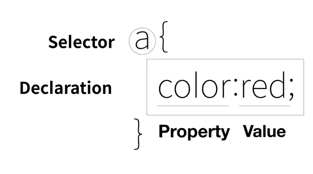

CSS정리
=====================================================================
**[기본적인 내용]**
HTML의 부족한 시각적 부분을 또 다른 언어인 CSS를 만들어 체웠다.(분업화) 중복되는 부분을 재거 할 수 있다
이런 중복 제거는 유지보수와 가독성을 높일 수 있다.

- - -

## 1) 기본 문법
>### (1) HTML에서 CSS언어 사용하기
> Web browser는 기본적으로 코드들을 HTML코트라고 생각하고 번역한다.
> 그러므로 CSS코드를 쓸 때에는 web broser에게 이 코드가 CSS라는 것을 HTML 코드로 알려줘야 한다. 한 효과에 대한 구분으로 반드시 뒤에 **`Declaration(;)`**를 붙인다.

> - **`<style>, </style>`** : 이 태그 안에 작성된 코드들은 CSS언어로 분석해 달라고 요청하는 태그이다. head태그 안에 들어가서 본문의 전체 내용에 관해서 시각적 변경사항을 작성하는 부분이다.

> - **`(tag){}`** : **`(tag)`** 는 Selector(선택자)라고 하며 이 page에 한정해서 어떤 tag에게 이 스타일을 지정해 줄지 선택한다. **`{}`**안에는 효과에 대한 내용이며 이를 Declaration(선언)이라고한다.

> - CSS의 주석은 **`//`**이다.



>>```
>> ex)
>> 본문의 모든 a 태그에 대한 글들의 글자색을 빨간색으로 변경해달라는 코드
>> <style>
>>  a{
>>    color:red;
>>    text-decoration: none;
>>   }
>> </style>
>>```

> - 특정한 HTML tag에 직접 효과를 주고 싶다면 tag에 **`style`** 이라는 속성을 사용하여 Declaration(선언)을 직접 적용하면 되고 이때는 Selector가 필요없다.
>>```
>>ex) 
>><a href="CSS_study.html" style="color:red;text-decoration:underline;"> CSS </a>
>>```

>### (2) 여러 CSS의 Declaration 영역에 사용되는 Property

> 추천 검색어 예시
>> ```
>>//이런 형식으로 검색하여 필요한 부분을 알아본다.
>> CSS text size property 
>> CSS text center property 
>> ```

> - **`color: `** : 색깔의 설정해준다.
>> ```
>> ex)  color:black, color:red
>> ```
> - **`text-decoration: `** : 텍스트의 꾸밈에 대해 설정해준다.
>> ```
>> ex) text-decoration: none
>> ```
> - **`font-size: `** : 글자의 크기를 설정할 수 있다.
>> ```
>> ex)  font-size: 50px;
>> ```
> - **`text-align: `** : 글자의 정렬을 정해준다.
>> ```
>> ex)  text-align: center;
>> ```
> - **`border-width : `** : 태그의 테두리의 넓이를 정해준다.
>> ```
>> ex)  border-width : 5px;
>> ```
> - **`border-color : `** : 태그의 테두리의 색깔을 정해준다.
>> ```
>> ex)  border-color : red; 
>> ```
> - **`border-style : `** : 태그의 테두리의 디자인을 정해준다.
>> ```
>> ex)border-style : solid;
>> ```
> - **`display : `** : 화면 상에 보여주는 것들을 바꿀 수 있다.
>> ```
>> ex)
>> //block level element를 inline element로 바꿔준다.
>> display : inline
>> //태그의 영향을 받지 않은 글을 볼 수 있다.
>> display : none
>> ```

## 2) 그룹으로 나누는 문법

> 추천 검색어 예시
>> ```
>> CSS Selector 
>> ```

> ### (1) class로 그룹 묶기
> HTML tag에 class라는 속성에 같은 이름을 주어서 그룹으로 묶고 head의 style태그안에 class선택자를 생성하여 Declaration를 작성하면 묶어서 한번에 속성을 줄수 있다. class는 다중 선택 가능하지만 보다 더 아래에 선언된 class가 더 큰 영향력을 주게된다.
>> ```
>> ex)
>> <head>
>>   <style>
>>   .saw {
>>     color:gray;
>>   }
>>   //.active가 .saw보다 아래있는 class이므로 영향력이 더 크다.
>>   .active {
>>      color:red;
>>    }
>>   </style>
>> </head>
>> <body>
>> <a href="1.html" class="saw"> HTML </a>
>> //class를 두개 같이 선언하는 방법
>> <a href="2.html" class="saw active"> HTML </a>
>> </body>
>> ```
> ### (2) id로 그룹 묶기
> HTML태그에 id라는 속성을 사용하여 그룹을 묶고 head의 style태그안에 id선택자를 만든다. id선택자는 선언된 HTML에서 한번만 사용가능하다.
>> ```
>> ex)
>> <head>
>>   <style>
>>     #active {
>>       color:red;
>>     }
>>     .saw {
>>       color:gray;
>>     }
>>   </style>
>> </head >
>> 
>> <a href="2.html" class="saw" id="active" > CSS </a>
>> ```

> - (우선순위)id선택자 > class선택자 > tag선택자
> - 같은 선택자 종류 끼리는 더 밑에 써져있는 것이 우선순위가 높다
> - tag선택자로 전체적 디자인을 선택하고 예외적인 것을 id로 디자인 한다.
> - 같은 내용의 속성을 적용하는 tag가 여러개 이다면 선택자로 나열하여서 적용 가능하다.
>> ```
>> ex)
>> h1, a{
>>   border-width : 5px;
>> }
>> ```
> - 같은 종류의 Property는 값을 연속으로 나열하면서 한번에 설정 가능하다.
>> ```
>> ex)
>> a{
>>   border-width : 5px;
>>   border-color : red;
>>   border : 5px red;  //<= 나열
>> }
>> ```
> - #(아이디 이름) [태그]를 선택자로 쓰면 저 아이디 밑에 있는 어떤 태그에 내용을 적용하라는 뜻이다.

- - -

## 3) CSS로 박스 모델
HTML태그 하나하나가 박스처럼 부피가 존재하도록 되어있다. 화면 전체를 사용하여 줄 바꿈이 되는 **`block level element`** 과 자기 부피 만큼을 사용하여 줄 바꿈을 하지 않는 **`inline element`** 이다. (여기서 element는 tag와 같은 뜻이다.)


- **`padding :`** : 이 설정은 content를 둘러싼 테두리안의 크기를 조정할 수 있다.
>```
>ex)  padding:20px;
>```
- **`margin :`** : 두 태그의 테두리를 기준으로 한 여백이 없어진다.
> ```
>ex)  margin:20px;
> ```
- **`width :`** : content의 크기를 조정할 수 있다.
> ```
>ex)  width:100px;
> ```

> ### (1) 그리드
> 박스형 모델을 이용한 문서의 각 부분을 배치하는 방법 중 하나다. 
> - **`<div>, </div>`** : 디자인에 박스모델을 쓰기 위해 생겨난 아무 기능도 없는 태그이다.(block level element이다.)
> - **`<span>,</span>`** : 이 태그는 div와 같은 기능을 한다. (inline element이다.)
>> ```
>> #grid{
>>  border : 5px solid pink;
>>  //화면을 변경하는 속성에 gird를 설정한다. 하지만 이 선언 만으로는 아무 것보 변화하지 않는다.
>>  display : grid; 
>>  //각각에 비율을 줄때는 (숫자)fr을 사용하고 정확한 pixel값을 줘서 사용하기도 한다.
>>  grid-template-columns : 150px 1fr;
>>}
>>
>> //body에 쓰게 되는 내용.
>> //두개의 태그를 나란히 배치하고 싶다면 그것을 감싸는 부모 태그가 필요하다.
>> <div id="grid">
>>    <div> NAVIGATION </div>
>>    <div> laborum </div>
>> </div>
>> ```

> ### (2) 반응형디자인
> 화면의 크기에 따라서 웹페이지 각 요소들 반응해서 동작하는 것을 말한다. 이것을 CSS에서 구현하기위해 Media query를 사용한다.
-  **`Media Query`** : 이것은 어떤 조건에 만족 했을 때만 CSS내용 동작하는 것을 기능을 제공한다.
>> ```
>> //min-width : (픽셀값) => screen width > (픽셀값)
>> //max-width : (픽셀값) => screen width < (픽셀값)
>> @media(max-width:800px) {
>>    //어떤 선택자도 사용 가능하다.
>>    div{
>>      display:none;
>>    } 
>>} 
>>```

- - -

## 4) CSS파일 재사용 
같은 CSS내용을 다른 페이지에 똑같이 적용할 때 이것이 여러개 있다면 작업하는데 효율이 나쁘다. 그러므로 확장자가 .css인 파일에 공통으로 쓰이는 CSS에 대한 내용을 넣어서 각 HTML파일에 이것을 적용하는 방법으로 중복을 줄이려한다.(이렇게 된다면 style tag도 필요 없다.)

- **`<link>`** : 이 태그를 사용하여 이 파일이 어떤 CSS파일과 연결되어 있는지를
웹브라우저에게 알려줄 수 있다.
>```
> ex) <link rel="stylesheet" href="style.css">
>```

- 캐싱이라는 기능 때문에 한번 다운 된 .css파일은 재사용 가능하게 되어 네트워크 트래픽을 줄일 수 있다.

- - -

## 5) 그외의
- 브라우저 > 화면에서 오른쪽 클릭 > 검사(Inspect)
- 검사(Inspact)에서 **`tag선택 > Styles`** 을 누르면 그 tag에 적용된 Style을 볼 수 있다.
- > <a href="https://caniuse.com/" target="_blank"> Can I use </a> 이 사이트는 웹의 최신 기술들이 웹브라우저들이 얼마나 사용하는자 알 수 있게 해준다.
