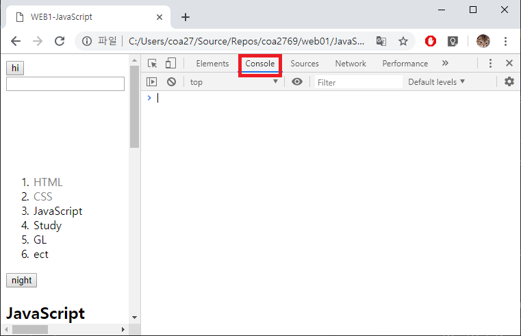

Javascript
================================================================
**[기본적인 내용]**
사용자와 상호 작용하기 위해 만들어진 언어로써 javaScript는 동적이다.(html은 정적이다.) 
```
ex) 
// document.write() : web page에 괄호안의 정보나 code를 추가한다.
// html에서 1+1을 쓰면 그래도 출력되지만 javascript에서는 1+1이 계산되어 2로 출력된다.
<script>
  document.write(1+1);
  document.write("text" + '< br >'); //<= tag & css code 적용 가능
  document.write('<div style="color:red">'+ "문자열" + '</div >');
</script>
```

- - -

## 1) 기본 문법
> ### (1) tag로 JS code 추가하는 방법
> HTML위에서 동작하는 JS(javaScript)는 웹브라우져에게 이 code가 JS라는 것을 알려줘야한다.
> -  **`<script>, </script>`** : 이 태그 안에 작성된 코드들은 JS로 분석한다. body, head 어디든 선언가능하다.
> - JS를 이용하여 제어하려는 tag를 **`selector(선택자, CSS참고)`**로 선택하고 JS  code의 동작에따라 CSS code를 삽입되어 화면에 변화를 준다.
> - JS의 주석은 //로 표현한다.
> 추천 검색어
>> ```
>> //JS를 이용하여 제어하고자 하는 tag 찾을 때
>> Javascript select tag by CSS selector
>> //CSS코드를 어떻게 JS로 넣는가?
>> Javascript element style
>> ```

> ### (2) Event Handle로 JS code 추가하는 방법
> tag에 줄 수 있는 속성 중 이벤트 속성(Event atrribute)의 ""안에 javascript내용을 넣을 수 있다. 사용자가 Web Page의 이벤트 속성에 맞는 작용을 tag한테 하면 JS code를 기억하고 있다가 실행한다. 이벤트 속성의 종류에는 **`onclic, onchage, onkeydown`** 등이 있다.
> - **`<input>`** : 사용자로 부터 입력을 받는 tag이다. type 속성으로 button, text(입력창) 등의 종류를 선택할 수 있다.
>> ```
>> //aler() : JS로 브라우저의 경고창을 띄워준다.
>> <input type="button" value="hi" onclick="alert('hi')">
>> ```
> **[추천 검색어]**
>> ```
>> Javascript (작용 내용) event attribute
>> ```

> ### (3) console로 JS code 실행
> 웹브라우저 >> 마우스 오른쪽 버튼 >> 검사 로 개발자 도구를 켤 수 있다. 여기서 console은 즉석에서 JS code를 실행하는 것이 가능하다.
> 
> 이 console에서 실행하는 JS code는 지금 해당하는 page의 code인 것 처럼 실행됩니다. element에서 ESC를 눌러 console 창을 보일 수 있다.

- - -

## 2) Data type
 JS는 변수를 사용할 수 있고 `입력하는` 값들에 Data type이있다. 또한 여러 연산자들을 사용할 수 있다. 단, 
 **[추천 검색어]**
 ```
 Javascript Data type
 ```
> ### (1) 기본 데이터 타입
> - **상수** : 산술연산이 가능하다.
>> ```
>> ex) 10
>> ```
> - **문자열** : 문자 데이터이다. 여러 처리를 도와주는 함수와 Properties이 있다. `Javascript string`로 검색 가능하다. 
>> ```
>> ex) 
>> // 두가지 모두 문자열을 나타낸다.
>> "문자 데이터"
>> '문자 데이터'
>>
>> //문자 개수를 알려주는 property
>> "문자 데이터".length
>> 
>> //문자열에서 +연산자는 두 문자열을 결합해준다.
>> "1" + "1" -> "11"
>> ```
> - **Boolean** : true와 false의 값만을 갖는 데이터 타입이다.
>> ```
>> <script>
>> //Comparison operator (비교 연산자)
>> //=== : 동등 비교 연산자 
>> document.write(1===1);
>> // <, > : 부등호
>> document.write(1 < 2);
>> </script>
>> ```
> ### (2) 변수(Variable)
> `변수` 에는 Data type이 없어서 아무 데이터나 입력해도된다.
>> ```
>> var name = 'leezche';
>> ```

> ### (3) 배열(Array)
> C/C++ 문법과 비슷하게 여러 변수들을 가지고 있고 []연산자로 접근 가능하다. 추가되는 변수에 대한 데이터 타입은 일정하게 같을 필요 없다는 점이 C/C++ 문법과 다르다.
>> ```
>> <script>
>> //배열의 선언과 값 초기화([]대괄호를 쓴다.)
>> var coworkers = ["egoing", "leeache"];
>> // 배열의 값을 가져오는 방법
>> document.write(coworkers[0]);
>> //배열의 길이를 가져오는 방법
>> document.write(coworkers.length);
>> //데이터 추가
>> coworkers.push('duru');
>> coworker.push('taeho');
>> </script>
>> ```
> **[추천 검색어]**
>> ```
>> javascript array add data
>> javascript array
>> ```

- - -

## 3) 조건문(Conditional Statement)
C/C++ 문법과 같이 **`if`** 을 사용 가능하다.
>> ```
>> ex)
>> //onclick 속성안에 JS code를 작성 가능하다.
>> <input type="button" value="night" onclick="
>>
>> //이 태그 안에서 자신을 가지리키고 싶다면 this를 사용한다.
>> if(this.value === 'night')
>> {
>>  //document.querySelector(선택자) : 선택자를 선택 할 수 있다. 단 첫 선택자만을 가져온다.
>>  //style.backgroundColor : 이 tag의 Backsround 색상이다.
>>  document.querySelector('body').style.backgroundColor = 'black';
>>  this.value = 'day';
>> }
>> else
>> {
>>   document.querySelector('body').style.backgroundColor = 'white';
>>   this.value = 'night';
>> }
>>  ">
>> ```
> **[추천 검색어]**
>> ```
>> //JS로 지금 테그의 요소를 가져고 싶을 때
>> JavaScript element get value
>> //JS에서 선택자를 이용하여 tag를 선택하고 싶을 때
>> JavaScript select tag by css select
>> //JS로 선택한 tag에 스타일을 변경하고 싶을 때
>> JavaScript element style
>> ```

- - -

## 4) 반복문(Loop Statement)
C/C++ 문법과 같이 **`while문과 for문`** 을 사용 가능하다.
> ### (1) while문
>> ```
>> ex)
>> //document.querySelectorALL(선택자) : 해당하는 선택자를 배열처럼 가져온다.(하지만 실제 배열은 아니다.)
>> var alist = document.querySelectorAll('a');
>>
>> var i = 0;
>> while(i < alist.length)
>> {
>>   //개발자 도구의 console에서 실행창에 값이 출력 된다.
>>   console.log(alist[i]);
>>
>>   //배열처럼 사용 가능
>>   alist[i].style.color = 'powderblue';
>>
>>   i=i+1;
>> }
>> ```
>**[추천 검색어]**
>> ```
>> //여러 선택자를 가져오는 방법 검색(여기서의 element는 tag가 아니라 요소이다.)
>> javascript get element by css selector multiple
>> ```

> ### (2) for문
>> ```
>> ex)
>> var coworkers = ["egoing", "leezche"];
>> //key변수에 coworkers 배열의 index 값이 0부터 size-1까지 code를 반복하면서 증가한다.
>> for(var key in coworkers)
>> {
>>    document.write(coworkers[key] + "<br>");
>> }
>> ```

- - -

## 5) 함수와 객체
code의 중복과 가독성을 위해 사용되는 문법이다.
> ### (1) 함수(Function)
> - 함수는 반복되는 code를 한 묶음으로 할 수 있다.
> - 나중에 봤을 때 그 Logic을 바로 이해하기 힘들다면 함수 이름으로 명확히 나타낼 수 있다. 
>> ```
>> ex)
>> //function이라 선언하여 정의한다.
>> function sum2(left, right){
>>   return left + right;
>> }
>> //사용은 이렇게
>> document.write(sum2(2,3) + '<br>');
>> ```

> ### (2) 객체(Object)
> C++의 class와 비슷한 기능을 제공하는데 Method와 연관된 변수를 한 객체로 묶어서 사용할 수 있다. 배열과 같이 데이터 타입과 관계없이 변수를 저장할 수 있지만 순서 없고 키 값(이름)으로 데이터를 꺼내 온다.
> - **객체 생성**
>> ```
>> //coworkers라는 객체에 이름을 붙여서 데이터 저장, {} 줄괄호를 사용한다.
>> var coworkers = {
>>
>>  //(키 값) : (변수 or 데이터)
>>   "programmer" : "egoing",
>>   "designer" : "leezche"
>> };

> - **객체에 접근**
>> ```
>> // . : 객체에 접근하는 기호
>> //객체에서 데이터 가져오기
>> document.write("programmer : " + coworkers.programmer + "<br>");
>> document.write("designer : " + coworkers.designer + "<br>");
>> // [] : 배열연산자로도 객체에 접근 가능하다.
>> document.write("bookeeper : " + coworkers["data scientist"] + "<br>"); 
>> ```

> - **객체에 정보 추가**
>> ```
>> //(객체).(키 값) = (변수 or 데이터)
>> coworkers.bookeeper = "buru";
>>
>> //띄어 쓰기가 키 값에 있을 때 []연산자는 객체에서도 사용 가능하다.
>> (객체)[(키 값)] = (변수 or 데이터)
>> coworkers["data scientist"] = "taeho";
>> ```

> - **Iterate(반복자)** <br>
> 반복문에서 객체를 순회하는 방법이다.
>> ```
>> var coworkers = {
>> "programmer" : "egoing",
>> "designer" : "leezche" 
>> };
>>
>> //Key에는 키 값이 들어간다.
>> for(var key in coworkers)
>> {
>>   document.write(key + ' : ' + coworkers[key] + '<br>');
>> }
>>
>> var aList = document.querySelectorAll('a');
>> var i = 0;
>>
>> //이렇게 객체를 순환하면 Method도 같이 순환하게 된다.
>> for(var key in aList)
>> {
>>     document.write(key + "<br>");
>> }
>> ```
> **[추천 검색어]**
>> ```
>> javascript object iteration
>> ```

> - **Property & Method** <br>
> 객체에는 Method도 저장할 수 있다. **`Method`**는 객체에 소속된 함수이고 **`Property`**는 객체의 키 값들이다.(여기서 키 값들은 class로 따지면 변수의 이름이다.)
>> ```
>> var coworkers = {
>> "programmer" : "egoing",
>> "designer" : "leezche" 
>> };
>>
>> //Method 내에서 자신이 소속된 객체를 나타내는 대명사는 this이다.
>> coworkers.showAll = function(){
>>   //단 showAll도 여기에 소속된 데이터이기 때문에 출력 된다.
>>   for(var key in this)
>>   {
>>     document.write(key + ' : ' + this[key] + '< br >');
>>   }
>> }
>>
>> //객체의 함수 호출
>> coworkers.showAll();
>> ```

- - -

## 6) 문서 분리 방법
.js파일을 만들어 그곳에 JS코드를 넣고 이 코드가 쓰일 html문서에 선언해준다.
>> ```
>>  < script src="colors.js" >< /script >
>> ```

- - -

## 7) library 와 framework
- franework는 기본 틀 위에서 구현하게하는 도구.
- library는 구현을 하기위해 필요한 부품들을 사용하여 구현하게하는 도구.
- jQuery CDN은 라이브러리를 다운 받을 필요 없이 `<script src="">`으로 웹브라우저가 다운로드 하도록 할 수 있다.

- - -

## 8) 그 외의
- js에서 html tag관련 내용을 찾고 싶다면 **`document`** 을 검색한다. 그래도 찾지 못하였다면 **`DOM(Document Object Model)`** 를 검색한다.
- 웹브라우저 자체를 제어하고 싶다면 **`window객체`** 을 검색한다.
- 웹페이지를 Reload하지 않고 정보 변경 하고 싶다면 **`ajaw테크닉`** 을 검색한다.
- Reload후에도 현재 상태를 유지하는 방법을 찾는 다면 **`cookie`** 를  검색한다.
- 인터넷이 끊켜도 동작하는 web page를 원한다면 **`offline web application`** 을 검색한다.
- **`webRTC`** : 화상통신
- **`speech`** : 음성 제어
- **`webGL`** : 3D Grapic 게임
- **`webVR`** : 가상현실

