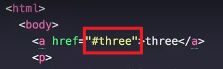

Ajax
=================================================
한 HTML page에서 사용자의 작용에 따라 부분적으로 변경하는 기술이다. 이런 Web page를 Single-page application이라고 한다.

## 2) fetch API
```
<!DOCTYPE html>
<html>
    <head>
        <title>WEB-Ajax</title>
        <meta charset="utf-8">
    </head>
    <body>
        <article>

        </article>
        <input type="button" value="fetch" onclick="
           //fetch함수의 매개변수로 대입한 파일이름에 맞는 파일을 server가 전송해준다.
           fetch('HTML_ex.html').then(function(response){
                //text 안에는 server가 전송한 파일의 내용이 있다.
               response.text().then(function(text){
                   //응답이 완료 되고 text의 내용을 응답창에 출력
                   //alert(text);
                   document.querySelector('article').innerHTML = text;
               })
            })
            /*fetch('HTML_ex').then(function(response){
                if(response.status == '404'){
                    alert('Not found')
                }
            });
            console.log(1);
            console.log(2);*/
           ">
    </body>
</html>
```


fetch('파일 이름') <br>
이 함수는 client가 server에게 매개변수로 넣은 `파일이름` 과 일치하는 파일을 전송해 달라고 요청한다.
응답으로 server에서 파일이 전송될 것이다.
>  ```
>  fetch('html');
>  ```

fetch('파일 이름').**`then(함수)`** <br>
fetch api 함수이다. 서버가 응답할 때까지 웹브라우저가 따른 일을 하기위해 호출된다. 서버에게 응답이 오면 then의 매개변수로 넣은 함수를 호출하도록(call back)등록하는 함수이다. 비동기(Asynchronous) 작동을 위한 함수이다.
then의 매개변수인 함수에는 **`response객체`** 를 넘겨주기로 되어 있으므로 매개변수 하나를 선언하자.
response객체에는 응답받은 데이터에 대한 내용이 있는데 이 중 status는 통신의 상태를 알려준다. http에서 200은 통신의 완료를 뜻한다. 찾는 파일이 없다면 status는 404이다.
>```
> function callbackme(response){
>     //console 창에 log가 출력된다.
>     console.log('response end');
> }
> fetch('html').then(callbackme);
> //위 함수는 서버의 응답을 기다리지 않고 반환하여 밑의 code를 실행한다.(비동기) 
> console.log(1);
> console.log(2);
>```

함수를 객체나 변수 처럼 선언하거나 매개변수로 넣을 수 있다.
>```
> function callbackme(){
>     console.log('response end');
> }
> 
> //객체나 변수 선언 처럼
> callbackme = function(){
>     console.log('response end');
> }
>
> //선언을 매개변수 안에
> fetch('html').then(function(response){
>       console.log('response end');    
> });
>```

## 4) 초기 페이지 구현
**`[문제점]`**
링크가 갖는 눈에 보이는 효과(밑줄, 색 변화, 마우스의 변화)가 없다.
링크를 눌렀을 때 주소의 변화가 없다.
**`[해결 방법]`**
hash
한 페이지의 특정 부분을 접근할 때 사용한다. 한 마디로 북마크 기능 URL의 마지막 부분에 id값이 들간다. 이 값을 알아오고 싶다면 window.location.hash로 알 수 있다.
ex) 3개의 문단 중 2번째에 접근하는 방법
1) 3개의 문단 중 마지막에 id값을 준다.


2) 주소에 지정한 id값을 주면 마지막 문단으로 이동한다.


3) a 태그를 이용할 수도 있다.


```
fragment identifier (조각 식별자)
how to get hash from url javascript
```

**`또 다른 문제점`**은 검색 엔진 최적화가 안된다.(검색 엔진은 page를 다운 받아서 검색을 하지만 ajax의 데이터 들은 back ground에서 가져온다.) 웹브라우져의 네비게이션 기능을 사용했을 때 화면이 바뀌지 않는다.
이에 따른 해결을 방법은 **`pjax`** 기술을 사용한다. 이 기술은 ajax의 연장선으로 지금의 문제점을 해결해준다.

## 5) 글목록 Ajax로 구현
글 목록(목차)도 데이터이다. 그러므로 언제나 바뀔수 있다. 

**`[추천 검색어]`**
```
how to make array from string in javascript
```

## 6) fetch API polyfill
Fetch API는 이때 당시 최신 기능이다. 과거의 브라우져는 지원하지 않을 수 있는데 그런 브라우져에서도 이런 최신 기능을 사용할 수 있게 도와주는 것이 **`polyfill`** 이다.
Fetch API 기술을 사용했을 때 지원하는 최신 브라우져는 브라우져 자체 기능을 사용하고 지원하지 않는 과거 브라우져는 기술에 맞는 라이브러리를 사용하여 기능한다. 이런 전반적인 것을 **`polyfill`** 이라고 한다. (위 제목이 검색어도 한다.)

라이브러리 다운 > 기술을 사용하는 프로젝트에 다운 받은 라이브러리 폴더 추가 > example에 따라 coding

## 7) 그 외
Ajax (Asynchronous JavaScript and XML)
내가 생성한 예제에서 txt파일로 정보를 저장한다. 더 많은 정보를 표현해서 저장하려고 사용하는 방법이 XML이다. 이것와 비슷한 기능을하는 또다른 방법이 JSON이다. 

**`Single Page Application`**는 ajax기술을 기반으로 구현된 웹 애플리케이션 들을 말한다. ajax 기술 말고도 다른 기술로도 구현 가능하다. 검색해보면 찾아볼 수 있다. PJAX(pushState + ajax) 
Progressive Web Apps는 single page application을 기반으로 오프라인에서도 구동하는 특성 추가. 