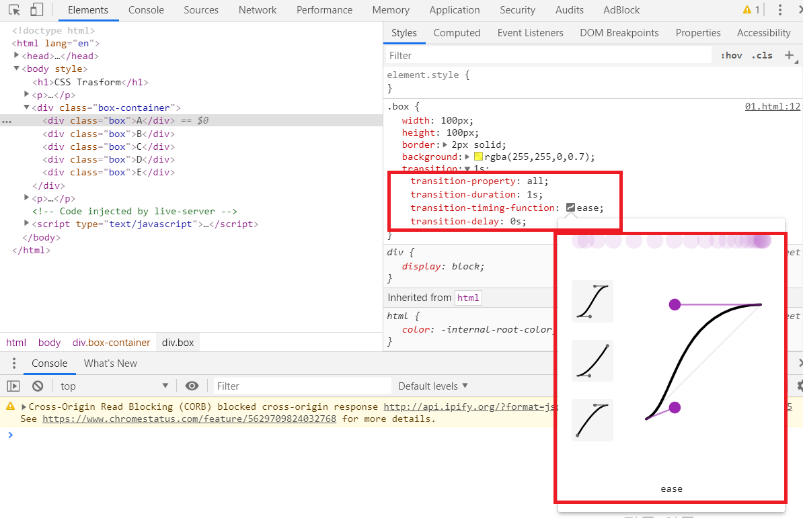

CSS_Interactive
====================================================
1) emmet 기능
원래는 아톰 edit에 있었던 기능으로 지금은 VS Code에도 이 기능이 내장되어 있다.

**[추천 검색어]**
```
//이런 기능을
HTML Snippets 라고 한다.

emmet 사용법
```

- ! + tab : html 기본 뼈대
- [tag].[class] + tab : class속성이 설정된 tag
- [tag].[class]>[child tag]*[count] + tab : 부모 tag와 자식 tag를 한번에 여러개 생성할 때 사용한다.
```html
ul.my-list>li*5

<!--결과-->
<ul class="my-list">
    <li></li>
    <li></li>
    <li></li>
    <li></li>
    <li></li>
</ul>

```
`>` : 바로 아래 단계의 자식 선택자 이다.

2) CSS Trasform
변형에 관련된 기술, CSS3 스펙부터 추가되었다. 크기 조정, 기준점 변경, 이동, 비틀기, 3D 등이 가능하다. 하드웨어 가속 이용. (포지션 앱솔루트보다 성능이 잘 나온다. GPS사용)
```css
.box:hover{
    /*transform을 사용하지 않았고 직접 조절 한다면
    기준점은 top & left가 되고 다른 나란히 존재하는 tag들을
    옆으로 밀어낸다.*/
    /* width: 200px;
    height: 200px; */

    /*transform를 사용한다면 중앙을 기준점으로 하여 작동하고 
    웹브라우저는 다른 tag들의 위치를 고려할 필요 없다.
    그러므로 성능도 뛰어나다.
    deg = 도*/
    /*크기 & 회전*/
    /* transform: scale(1.2) rotate(45deg); */
    /* 비틀기 */
    /* transform: skewY(-30deg); */
    /*이동*/
    /* transform: translate(30px, 10px); */

    /* 기준점 변경 */
    transform: scale(1.5);
    /* transform-origin: left top; */
    transform-origin: 30% 80%;

}
```
3) CSS Transition
CSS로 애니메이션을 줄 수 있는 속성이다.
transition: 1s;는 여러 기본 값에 의해 시간만 정해주면 애니메이션이 작동한다.
아래 그래프는 애니메이션을 자연스럽게 보여주는 가속도의 그래프이다. 조정하여 그래프 아래 속성 값을 복사하여 적용 가능하다.


transition은 기본적으로 적용된 속성 값에서 사용자의 동작에 의해 변경되는 속성 값 사이에 시간을 주어 점점 변하도록 하는 기술이다.
속성 값이 auto이면 transition은 적용되지 않는다. 꼭 숫자값을 넣어야 적용된다.
```css
.box{
    width: 100px;
    height: 100px;
    border: 2px solid;
    background: rgba(255,255,0,0.7);
    /*이렇게 시간을 주어서 애니메이션을 줄 수 있다.
    transition: 1s;는 아래 내용이 축약되어 있는 것이다.
        transition-property: all;
        transition-duration: 1s;
        transition-timing-function: ease;
        transition-delay: 0s;
    */
    transition: 1s cubic-bezier(0.25, 0.1, 1, 1.62);
}

.box:hover{
    width: 200px;
    background: red;
}
```

4) CSS Animation
