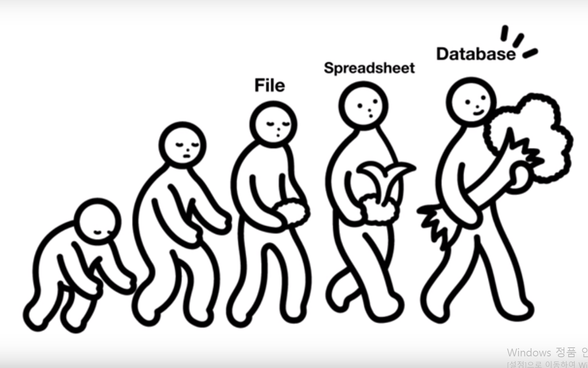

Database
==========================================
**[데이터를 관리하는 방법]**
file 
장점 : 사용이 쉽고 어떤 os에서도 지원해준다.
단점 : 성능과 보안, 편의성에 한계가 있다.

이걸 해결하기 위해 Database를 사용한다.
이런 데이터를 다루는 기술들에서 중요한 것을 어떻게 **입력** 하고 어떻게 **출력** 하는지가 중요하다.

`input` : Create, Update, Delete
`output` : Read 

DataBase는 컴퓨터 언어를 이용하여 데이터의 관리를 자동화 할 수 있다.
DB도 결국에는 정보를 file에 저장한다.

MySQL
==========================================

## 1) 데이터베이스의 목적

## 2) 설치

## 3) 구조

## 4) 서버 접속

## 5) 스키마(schema)의 사용

## 6) SQL과 테이블 구조

## 7) 테이블 생성

## 8) CRUD

## 9) INSERT 구문

## 10) SELECT 구문

## 11) UPDATE 구문

## 12) DELETE 구문

## 13) 관계형 데이터베이스의 필요성

## 14) 테이블 분리하기

## 15) JOIN

## 16) 인터넷과 데이터베이스

## 17) Client

## 18) Workbench

