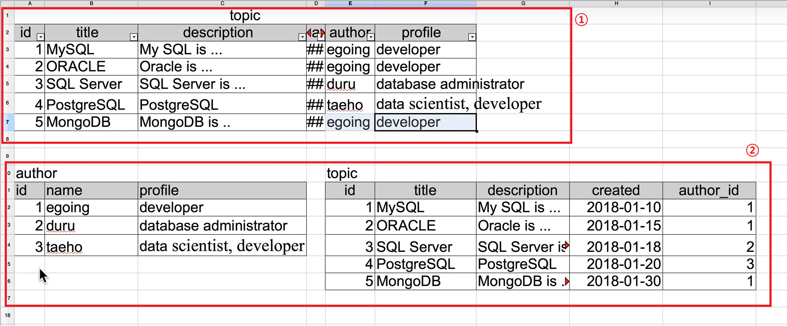
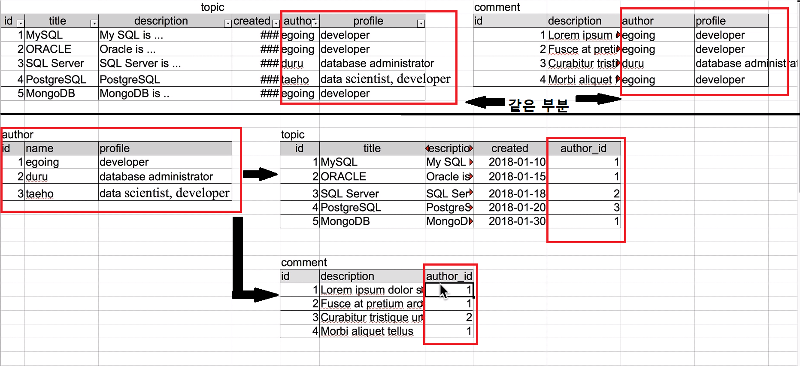

Database
==========================================
**[데이터를 관리하는 방법]**
file 
장점 : 사용이 쉽고 어떤 os에서도 지원해준다.
단점 : 성능과 보안, 편의성에 한계가 있다.

이걸 해결하기 위해 Database를 사용한다.
이런 데이터를 다루는 기술들에서 중요한 것을 어떻게 **입력** 하고 어떻게 **출력** 하는지가 중요하다.

`input` : Create, Update, Delete
`output` : Read 


DataBase는 컴퓨터 언어를 이용하여 데이터의 관리를 자동화 할 수 있다.또한 자체적 보안체계를 가지고 있어 file보다 안전하게 데이터를 보관할 수 있다.
DB도 결국에는 정보를 file에 저장한다.

MySQL
==========================================
## 2) 설치
**[추천 검색어]**
```
install mysql in ubuntu [버전]
```
mysql버전은 확인은 `mysql --version` 명령을 하면된다.

## 3) 구조
`Table` : 정보가 저장되는 곳
`DataBase` : 비슷한 표들이 그룹으로 묶은 것. (= `Schema (스키마)`)
`DtaBase Server` : 여러 스키마들이 모여는 있는 것. 우리는 DataBase Server를 설치한 것이다. 이 프로그램의 기능으로 DataBase들을 제어한다. 


## 4) DataBase 서버에 접속
@ mysql_secure_installation이 스크립트를 실행했다면 root권한으로만 mysql에 접속할 수 있다.
```
mysql -u[사용자] -p

//루트 사용자로 접속하겠다는 뜻
mysql -uroot -p
```

## 5) 스키마(schema)의 사용
(1) 생성
```
mysql> CREATE DATABASE opentutorials;
Query OK, 1 row affected (0.01 sec)

```
**[추천 검색어]**
```
mysql create database
```

(2) 삭제
```
mysql> DROP DATABASE opentutorials;
Query OK, 0 rows affected (0.02 sec)

```
**[추천 검색어]**
```
mysql delete database
```

(3) 전체 데이터 베이스 출력
```
mysql> SHOW DATABASES;
+--------------------+
| Database           |
+--------------------+
| information_schema |
| mysql              |
| opentutorials      |
| performance_schema |
| sys                |
+--------------------+
5 rows in set (0.00 sec)

```
**[추천 검색어]**
```
how to show database list in mysql
```

(4) 데이터베이스 선택
```
mysql> USE opentutorials;
Database changed

```
## 6) SQL과 테이블 구조
SQL(Structured Query Language) : 구조화된 데이터에 필요한 처리를 요청을 하는 언어


`Column(= 열)` : 데이터의 타입 ex) id, title, description, created
`Row(= record, 행)` : 데이터의 구조 

## 7) 테이블 생성
데이터 베이스의 Column에는 Data Type이 있다. 적당한 저장공간을 갖게 하기위해 각 Column의 특성에 맞는 Data Type을 정해야한다.
```sql
//규칙
mysql> CREATE TABLE [Table이름](
    //NOT NULL : null을 허용하지 않는다.
    //AUTO_INCREMENT : 자동 채우기
    -> [Column이름] [Data Type] [NOT NULL] [AUTO_INCREMENT],
    -> .
    -> .
    -> (more)
    -> .
    -> .
    //Table를 대표하는 Column을 선택한다. 중복을 막기 위한 key
    -> PRIMARY KEY([Column 이름]));


mysql> CREATE TABLE topic(
    -> id INT(11) NOT NULL AUTO_INCREMENT,
    -> title VARCHAR(100) NOT NULL,
    -> description TEXT NULL,
    -> created DATETIME NOT NULL,
    -> author VARCHAR(30) NULL,
    -> profile VARCHAR(100) NULL,
    -> PRIMARY KEY(id));


```

**[추천 검색어]**
```
create table in mysql
//컨닝 페이퍼
create table in mysql cheat sheet

mysql datatype number

```

## 9) INSERT 구문
Colum에 맞게 데이터를 추가하는 방법.
```
//규칙
//table의 Column을 보여준다.
DESC [table 이름];

mysql> DESC topic;

//규칙
//table에 데이터를 추가한다.
mysql> INSERT INTO [table이름]([작성할 Column 이름들..]) VALUES([대응하는 값]);

//NOW()는 지금의 시간을 값으로 넣어준다.
mysql> INSERT INTO topic(title, description, created, author, profile) VALUES('MySQL', 'MySQL is ...', NOW(), 'egoing', 'developer');

Query OK, 1 row affected (0.00 sec)

```

**[추천 검색어]**
```
mysql create row
```

## 10) SELECT 구문
table의 내용을 읽기는 방법. SELECT문은 사용자가 가장 많이 사용하게 되는 구문으로 중요하다.
```
//규칙
mysql> SELECT * FROM [table 이름];

// * 는 모든 Column을 선택
mysql> SELECT * FROM topic;
+----+------------+--------------------+---------------------+--------+---------------------------+
| id | title      | description        | created             | author | profile                   |
+----+------------+--------------------+---------------------+--------+---------------------------+
|  1 | MySQL      | MySQL is ...       | 2019-05-16 13:57:24 | egoing | developer                 |
|  2 | MySQL      | MySQL is ...       | 2019-05-16 14:06:03 | egoing | developer                 |
|  3 | ORACLE     | ORACLE is ...      | 2019-05-16 14:10:24 | egoing | developer                 |
|  4 | SQL Server | SQL Server is..... | 2019-05-16 14:11:31 | duru   | data administrator        |
|  5 | PostgreSQL | PostgreSQL is ...  | 2019-05-16 14:13:31 | taeho  | data scientist, developer |
|  6 | MongoDB    | MongoDB is ....    | 2019-05-16 14:14:48 | egoing | developer                 |
+----+------------+--------------------+---------------------+--------+---------------------------+

//규칙
mysql> SELECT [출력할 Column들...] 
    -> FROM [table 이름];

mysql> SELECT id, title, created, author
    -> FROM topic
    -> WHERE author='egoing';
+----+---------+---------------------+--------+
| id | title   | created             | author |
+----+---------+---------------------+--------+
|  1 | MySQL   | 2019-05-16 13:57:24 | egoing |
|  2 | Oracle  | 2019-05-16 14:06:03 | egoing |
|  3 | ORACLE  | 2019-05-16 14:10:24 | egoing |
|  6 | MongoDB | 2019-05-16 14:14:48 | egoing |
+----+---------+---------------------+--------+
4 rows in set (0.00 sec)


//규칙
mysql> SELECT [출력할 Column들...]
    -> FROM [table 이름]
    -> WHERE [특정 row에 대한 조건];

mysql> SELECT id, title, created, author
    -> FROM topic
    -> WHERE author='egoing';
+----+---------+---------------------+--------+
| id | title   | created             | author |
+----+---------+---------------------+--------+
|  1 | MySQL   | 2019-05-16 13:57:24 | egoing |
|  2 | Oracle  | 2019-05-16 14:06:03 | egoing |
|  3 | ORACLE  | 2019-05-16 14:10:24 | egoing |
|  6 | MongoDB | 2019-05-16 14:14:48 | egoing |
+----+---------+---------------------+--------+
4 rows in set (0.00 sec)


//규칙
mysql> SELECT [출력할 Column들...] 
    -> FROM [table 이름] 
    -> WHERE [특정 row에 대한 조건]
    -> ORDER BY [특정 Column에 의한 정렬방법];

//DESC : 내림차순
mysql> SELECT id, title, created, author
    -> FROM topic
    -> WHERE author='egoing'
    -> ORDER BY id DESC;
+----+---------+---------------------+--------+
| id | title   | created             | author |
+----+---------+---------------------+--------+
|  6 | MongoDB | 2019-05-16 14:14:48 | egoing |
|  3 | ORACLE  | 2019-05-16 14:10:24 | egoing |
|  2 | Oracle  | 2019-05-16 14:06:03 | egoing |
|  1 | MySQL   | 2019-05-16 13:57:24 | egoing |
+----+---------+---------------------+--------+
4 rows in set (0.00 sec)


//LIMIT (숫자) : 최대 몇개만 출력할 것인가?
mysql> SELECT id, title, created, author
    -> FROM topic
    -> WHERE author='egoing'
    -> ORDER BY id DESC LIMIT 2;
+----+---------+---------------------+--------+
| id | title   | created             | author |
+----+---------+---------------------+--------+
|  6 | MongoDB | 2019-05-16 14:14:48 | egoing |
|  3 | ORACLE  | 2019-05-16 14:10:24 | egoing |
+----+---------+---------------------+--------+
2 rows in set (0.00 sec)


```

**[추천 검색어]**
```
how to read row in mysql

mysql select syntax
```

## 11) UPDATE 구문
table의 데이터를 수정하는 구문이다.
```
//조건 
mysql> UPDATE [table 이름] 
    -> SET [변경할 column]=[값]...
    -> WHERE [변경할 row의 조건];


mysql> UPDATE topic 
    -> SET description='Oracle is ...', title='Oracle'
    -> WHERE id=2;
Query OK, 1 row affected (0.00 sec)
Rows matched: 1  Changed: 1  Warnings: 0

```

**[추천 검색어]**
```
sql update in mysql
```

## 12) DELETE 구문
table의 데어터를 삭제하는 구문이다.
```
//규칙
mysql> DELETE FROM [테이블 이름]
    -> WHERE [변경할 column의 조건];

mysql> DELETE FROM topic
    -> WHERE id=6;
Query OK, 1 row affected (0.00 sec)

```

## 13) 관계형 데이터베이스의 필요성
1번의 table을 2번 처럼 author과 topic인 두개의 table로 나누어 중복을 피한다.


이런 작업을 DB는 좀더 편리하게 생성할 수 있다.

또한 Join으로 두 table을 엮을 수 있다.


## 15) JOIN
(1) 테이블을 분리한다.


(2) Join으로 두 테이블을 연결한다.
topic table의 author_id의 값과 author table의 id값을 연결하여 한 table로 엮는다.
```
//규칙
mysql> SELECT [출력할 Column들...]
    -> FROM [테이블 이름]
    -> LEFT JOIN [테이블 이름]
    -> ON [엮을 테이블 Column] = [엮을 테이블 Column];

mysql> SELECT * 
    -> FROM topic 
    -> LEFT JOIN author 
    -> ON topic.author_id = author.id;
+----+------------+-------------------+---------------------+-----------+------+--------+---------------------------+
| id | title      | description       | created             | author_id | id   | name   | profile                   |
+----+------------+-------------------+---------------------+-----------+------+--------+---------------------------+
|  1 | MySQL      | MySQL is ...      | 2018-01-01 12:10:11 |         1 |    1 | egoing | developer                 |
|  2 | Oracle     | Oracle is ...     | 2018-01-03 13:01:10 |         1 |    1 | egoing | developer                 |
|  5 | MongoDB    | MongoDB is ...    | 2018-01-30 12:31:01 |         1 |    1 | egoing | developer                 |
|  3 | SQL Server | SQL Server is...  | 2018-01-20 11:01:10 |         2 |    2 | duru   | database administrator    |
|  4 | PostgreSQL | PostgreSQL is ... | 2018-01-23 01:03:03 |         3 |    3 | taeho  | data scientist, developer |
+----+------------+-------------------+---------------------+-----------+------+--------+---------------------------+
5 rows in set (0.00 sec)

//두 Table이 같은 Column을 사용하면 판별할 수 없다고 Error가 난다.
mysql> SELECT id, title, description, created, name, profile
    -> FROM topic
    -> LEFT JOIN author
    -> ON topic.author_id = author.id;
ERROR 1052 (23000): Column 'id' in field list is ambiguous

//그러므로 명확히 어떤 table의 Column인지 명시해야한다.
mysql> SELECT topic.id, title, description, created, name, profile
    -> FROM topic
    -> LEFT JOIN author
    -> ON topic.author_id = author.id;
+----+------------+-------------------+---------------------+--------+---------------------------+
| id | title      | description       | created             | name   | profile                   |
+----+------------+-------------------+---------------------+--------+---------------------------+
|  1 | MySQL      | MySQL is ...      | 2018-01-01 12:10:11 | egoing | developer                 |
|  2 | Oracle     | Oracle is ...     | 2018-01-03 13:01:10 | egoing | developer                 |
|  5 | MongoDB    | MongoDB is ...    | 2018-01-30 12:31:01 | egoing | developer                 |
|  3 | SQL Server | SQL Server is...  | 2018-01-20 11:01:10 | duru   | database administrator    |
|  4 | PostgreSQL | PostgreSQL is ... | 2018-01-23 01:03:03 | taeho  | data scientist, developer |
+----+------------+-------------------+---------------------+--------+---------------------------+
5 rows in set (0.00 sec)


```

(3) 한 테이블의 정보를 여러 테이블에서 Joint할 수 있다.

테이블을 나눈다면 서로 다른 테이블과 여러 관계(Joint)를 가실 수 있다.
```
mysql> SELECT * FROM comment;
+----+-------------------------------------------+--------+
| id | description                               | author |
+----+-------------------------------------------+--------+
|  1 | Lorem ipsum dolor sit ament, conserctetur |      1 |
|  2 | Fusce at pretium arcum vitae varius       |      1 |
|  3 | Curabitur tristique urna ut ex egestas    |      2 |
|  4 | Morbi aliquet tellus                      |      1 |
+----+-------------------------------------------+--------+
4 rows in set (0.00 sec)

mysql> SELECT * FROM author;
+----+--------+---------------------------+
| id | name   | profile                   |
+----+--------+---------------------------+
|  1 | egoing | developer                 |
|  2 | duru   | database administrator    |
|  3 | taeho  | data scientist, developer |
+----+--------+---------------------------+
3 rows in set (0.00 sec)

mysql> SELECT comment.id, description, name, profile
    -> FROM comment 
    -> LEFT JOIN author 
    -> ON comment.author = author.id;
+----+-------------------------------------------+--------+------------------------+
| id | description                               | name   | profile                |
+----+-------------------------------------------+--------+------------------------+
|  1 | Lorem ipsum dolor sit ament, conserctetur | egoing | developer              |
|  2 | Fusce at pretium arcum vitae varius       | egoing | developer              |
|  4 | Morbi aliquet tellus                      | egoing | developer              |
|  3 | Curabitur tristique urna ut ex egestas    | duru   | database administrator |
+----+-------------------------------------------+--------+------------------------+
4 rows in set (0.01 sec)

```

## 16) 인터넷과 데이터베이스
mysql을 설치하때 우리는 두개의 프로그램, DataBase Client와 DataBase Server를 설치 해준다.
DataBase Server는 직접 접근 할 수 없다. 꼭 DataBase Client를 통해 접근해야한다.
(이것은 인터넷의 server에 client가 요청을 하는 것과 같은 맥락이다.)
mysql>가 명령어 기반의 DataBase client(ex MySQL moniton)이다.

DataBase Workbench는 GUI 환경의 DataBase Client이다. 
(서버에서는 GUI환경 때문에 리소스를 많이 차지하기 때문에 사용되지 않는다.)

## 19) 수업을 마치며
**[추천 검색어]**
```
DataBase index(색인)기능
DataBase Modeling(table을 어떻게 구성 할거인가?)

//DataBase Backup
Mysqldump, binary log 

//Cloud
AWS RDS
Google Cloud SQL for MySQL
AZURE Database for MySQL

//Programming
Python mysql api
PHP mysql api
Java mysql api

```