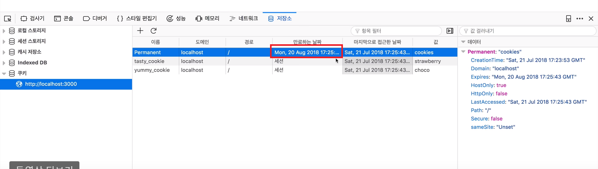
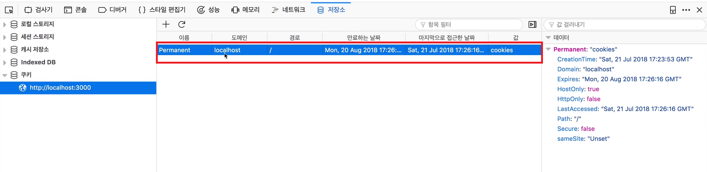
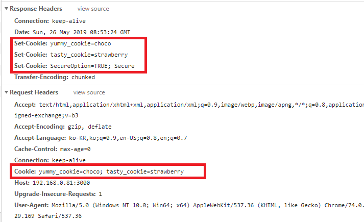
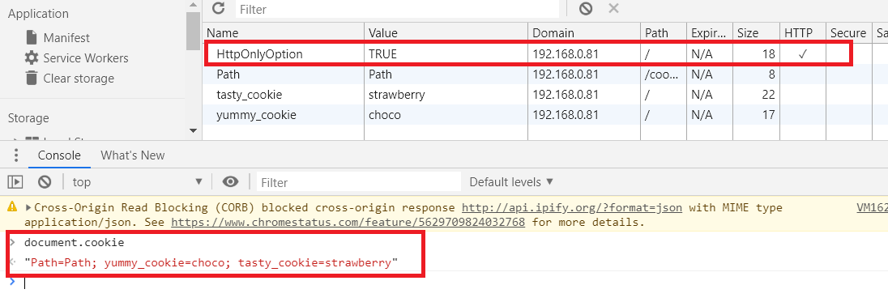
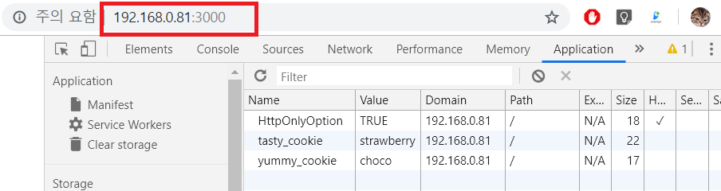
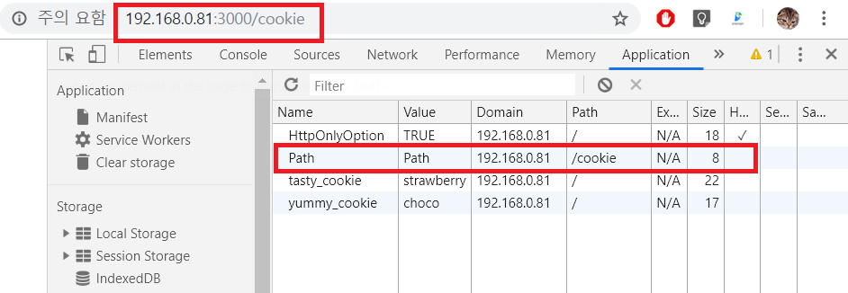

Nodejs Cookie
=========================================

(1) 쿠키 생성
```js
var http = require('http');
http.createServer(function(request, response){
    //Cookie를 추가해서 전송한다.
    response.writeHead(200, {
        'Set-Cookie':['yummy_cookie=choco', 'tasty_cookie=strawberry']
    });
    response.end('Cookie!!');
}).listen(3000);
```

Response의 header에서 Cookie가 추가되어서 전송된다.


그후 다시 리로드하니 Request의 header에도 Cookie가 추가되어 전송된다.


(2) 쿠키 읽기

```js
var http = require('http');
var cookie = require('cookie');
http.createServer(function(request, response){
    var cookies = {};
    //request로 받은 쿠키가 있는가?
    if(request.headers.cookie !== undefined){
        //있다면 그걸 파싱해서 객체로 반환
        cookies = cookie.parse(request.headers.cookie);
    }
    console.log(cookies.yummy_cookie);
    response.writeHead(200, {
        'Set-Cookie':['yummy_cookie=choco', 'tasty_cookie=strawberry']
    });
    response.end('Cookie!!');
}).listen(3000);
```

**[추천 검색어]**
```
how to get cookie in nodejs
npm cookie
```

(3) 쿠키 활용
쿠키는 내가 보는 웹페이지를 나에게 맞게 출력해줄 수 있도록 서버에게 전송되는 값이다. 서버는 이 값을 받아 어떤 그에 맞게 웹페이지를 전송해준다.

한 예로 내가 mozilla사이트에서 언어를 한국어로 지정했을 때 쿠키가 생성되고 다시 접속하게 되었을 때 이 쿠키에 의해 자동으로 언어아 한구어로 지정된다.

또한 로그인에 사용되는 세션값이 있다. 로그인을 판별하는 (아이디와 비밀번호와는 아무상관 없는 값이다.)이 값을 다른 브라우저 프로그램에서 이 값을 쿠키로 저장하여 전송하면 로그인된 페이지를 볼 수 있다.(그러므로 이런 세션값이 해킹에 많이 쓰인다.)

(4) Session 쿠키 VS Permanent 쿠키
쿠키를 언제까지 살아있게 할것인가에 대한 내용

`Session Cookie` : 웹브라우저가 켜져있을 때만 유효하다. 꺼지면 사라져있다.
ex)
```js
 response.writeHead(200, {
        'Set-Cookie':[
            'yummy_cookie=choco', 
            'tasty_cookie=strawberry'
        ]
 });
```

`Permanent Cookie` : Permanent (지속적인, 영속적인), 웹브라우저를 다시 켜도 살아있다.
ex)
```js
//Max-Age : 상대적으로 cookie를 받은 후 부터 얼마간 살아있을 것인가?
//Expires : cookie가 언제 죽을 것인가?(더이상 사용할 수 없는 상태)
 response.writeHead(200, {
        'Set-Cookie':['Permanent=cookies; Max-Age=${60*60*24*30}']
 });
```
받은 쿠키중 yummy_cookie,tasty_cookie는 세션 쿠키이고 Permanent는 Permanent쿠키인 것을 확인 할 수 있다. 또한 permanent 쿠키의 만료일을 확인 할 수 있다.


웹브라우저를 다시 켜면 Permanent쿠키만 남아있는 것을 볼 수 있다.


(5) 쿠키 옵션 - Secure & HttpOnly
보안과 관련된 설정

`Secure` : 웹브라우저와 웹서버가 https로 통신하는 경우만 웹브라우저가 쿠키를 서버로 전송하는 옵션이다. 이 옵션은 로그인과 관련된 Session Cookie의 탈취를 막기위한 것이다.
```js
 response.writeHead(200, {
        'Set-Cookie':[
            'SecureOption=TRUE; Secure'
        ]
 });
```
http로 웹브라우저가 접속한 상황인데 Secure옵션이 있는 SecureOption는 전송되지 않는걸 볼 수 있다.


`HttpOnly` : 웹브라우저에서는 보이지만 JavaScript의 document.cookie를 이용해서 쿠키에 접속하는 것은 막는 옵션이다. 쿠키를 훔쳐가는 행위를 막기 위한 방법입니다. 이 옵션 또한 로그인과 관련된 Session Cookie의 탈취를 막기위한 것이다.
```js
response.writeHead(200, {
        'Set-Cookie':[
            'HttpOnlyOption=TRUE; HttpOnly'
        ]
 });
```


(6) 쿠키 옵션 - path & domain
쿠키의 유효범위를 정의하는 옵션이다. 

`path` : 특정 directy를 지정하여서 유효범위를 정의 할 수 있다.

```js
response.writeHead(200, {
    'Set-Cookie':[
        'Path=Path; Path=/cookie'
    ]
});
```
URL의 주소부분이 Path 옵션에 설정한 주소와 동일하지 않다면 Path Cookie는 비활성화 되어 보이지 않습니다.

URL의 주소부분이 Path옵션에 설정된 주소와 동일하기 때문에 Path Cookie는 활성화 된다.


`domain` : 어떤 domain(IP니 DNS의 domain name)에서 유효한지 정의한다.
```js
response.writeHead(200, {
'Set-Cookie':[
    'Domain=Domain; Domain=o2.org'
]
```
위 예제에서 [sub domain].o2.org과 같이 앞에 어떤 sub domain이 붙든 뒤의 .o2.org로 인해 유효한 범위안이 된다.

(7) 쿠키를 이용한 인증 기능 구현
이 인증 기능은 Cookie로 아이디와 비밀번호가 바로 노출될 수 있기 때문에 실제 구현에서는 사용되지 않는다.


로그인 기능을 구현하는 이유는 client를 인증하므로써 접근제어(ACR)를 하기위해서 이다.


(8) 수업을 마치며
[도전 과제]
```
//쿠키 대신 인증에 사용되는 것
Session

Cookie를 이용한 개인화 기능

//Cookie 외의 브라우저의 정보를 저장하는 방법
LocalStorage
Indexed DB
```
이걸 해결하기 위해서는 Hash, salt, key stretching을 중첩적으로 사용하여 로그인 정보를 보호한다. 이를 도와주는 모듈은 PBKDF2, bcrypt를 사용한다.


개인화 사례
```js
var http = require('http');
var cookie = require('cookie');
var url = require('url');
function ColorMode(request, response){
    
}
http.createServer(function(request, response){
    var _url = request.url;
    var queryData = url.parse(_url, true).query;
    var cookies = request.headers.cookie ? cookie.parse(request.headers.cookie) : {};
    var css = '';
    if(queryData.type === 'night') {
        response.writeHead(200, 
            {'Set-Cookie':['type=night; ']}
        );
        css = 'background-color:black; color:white;';
    } else if(queryData.type === 'day') {
        response.writeHead(200, 
            {'Set-Cookie':['type=day']}
        );
        css = 'background-color:white; color:black;';
    } else {
        if(cookies.type === 'night'){
            css = 'background-color:black; color:white;';
        } else {
            css = 'background-color:white; color:black;';
        }
    }
    response.end(`
    <html>
        <body style="${css}">
            <a href="?type=night">night</a>
            <a href="?type=day">day</a>
        </body>
    </html>
    `);
}).listen(3000);
```