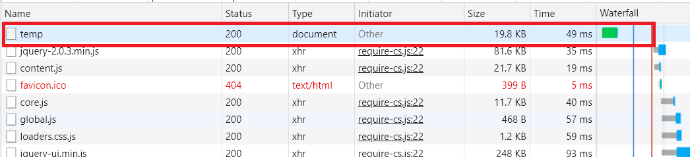
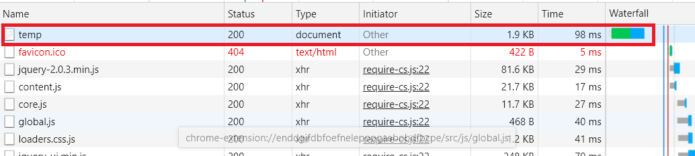

Nodejs - Express
===============================================
Express의 주요 기능은 router와 middleware이다.

[Express 설치]
```
npm install express --save
```

(1) 기본 code
```js
//기본 
const express = require('express')
const app = express()

//if문을 사용할 필요없이 

//get : route, routing을 해주는 함수이다. 

//app.get('/', (req, res) => res.send('Hello World!')), get방식으로 전송된다.
//위 code는 아래와 같이 해석 가능하다.
app.get('/', function(req, res){ 
  return res.send('Hello World!');
});

// '192.168.0.81:3000' => Hello World가 페이지에 그려진다.
// '192.168.0.81:3000/page' => /page가 페이지에 그려진다.
app.get('/page', function(req, res){
  return res.send('/page');
});

//listen함수가 호출되면서 웹서버가 실행되고 정상작동 된다면 callback함수가 호출된다.
app.listen(3000, function(){ 
  console.log('Example app listening on port 3000!')
});
```

(2) 홈페이지 구현
```js
// '192.168.0.81:3000'
app.get('/', function(requset, response){ 
    fs.readdir('./data', function(error, filelist){
    var title = 'Welcome';
    var description = 'Hello, Node.js';
    var list = template.list(filelist);
    var html = template.HTML(title, list,
      `<h2>${title}</h2>${description}`,
      `<a href="/create">create</a>`
    );
    response.send(html);
  });
});

```


(3) 상세보기 페이지 구현
**[검색해 볼 검색어]**
```
시멘틱 UI, 프레티 UI
```

// /page/HTML
Express의 get함수 routing guide부분을 참조하였다.
```js
app.get('/page/:pageName', function(request, response){
  var pageName = request.params["pageName"];

  fs.readdir('./data', function(error, filelist){
    var filteredId = path.parse(pageName).base;
    fs.readFile(`data/${filteredId}`, 'utf8', function(err, description){
      var sanitizedTitle = sanitizeHtml(pageName);
      var sanitizedDescription = sanitizeHtml(description, {
        allowedTags:['h1']
      });
      var list = template.list(filelist);
      var html = template.HTML(sanitizedTitle, list,
        `<h2>${sanitizedTitle}</h2>${sanitizedDescription}`,
        ` <a href="/create">create</a>
          <a href="/update?id=${sanitizedTitle}">update</a>
          <form action="delete_process" method="post">
            <input type="hidden" name="id" value="${sanitizedTitle}">
            <input type="submit" value="delete">
          </form>`
      );
      response.send(html);
    });
  });
});
```

(4) 페이지 기능들 구현
```js
//생성 기능이다. 그 외의 기능도 비슷하다.

// 192.168.0.81:3000/create 는 get, post방식에 따라 다른 함수가 호출된다.
app.post('/create', function(request, response){
    //express는 nodejs로 만든 framework이기 때문에 nodejs의 code를 사용할 수 있다.
    //그러므로 아래는 nodejs code를 그대로 사용했다.
    var body = '';
    request.on('data', function(data){
        body = body + data;
    });
    request.on('end', function(){
        var post = qs.parse(body);
        var title = post.title;
        var description = post.description;
        fs.writeFile(`data/${title}`, description, 'utf8', function(err){
          //생성한 page로 이동한다.
          response.writeHead(302, {Location: `/page/${title}`});
          response.end();
        });
    });
});
```

(7) Express 미들웨어의 사용
다른 사람이 만든 소프트웨어를 사용하여 나의 소프트웨어를 만드는데 이때 사용되는 이미 만들어진 소프트웨어를 미들웨어라고 한다.
third-party : 남들이 만든

ex)
```js
//body-parser라는 미들웨어를 사용한다.

//npm install body-parser --save
//이렇게 프로젝트에만 적용되도록 설치한다.
//사용자가 전송한 Post 데이터를 분석한다.
var bodyParser = require('body-parser');

//
//form data는 이렇게 처리한다.
app.use(bodyParser.urlencoded({extended: false}));
//json data도 다른 함수로 처리 가능하다.

//여기서 request에 body property가 생긴다.
app.post('/create', function(request, response){
    //body property를 사용가능하다.
    var post = request.body;
    fs.writeFile(`data/${post.title}`, post.description, 'utf8', function(err){
    response.writeHead(302, {Location: `/page/${post.title}`});
        response.end();
    });
});
```

ex)
```js
//compression미들웨어를이용해서 컨텐츠를 압출해서 전송하는 방법

//server는 여러 client의 요청을 처리하므로 너무 큰 파일을 전송받으면 문제가 생길 수 있다.
//그래서 압축을 하여 주고받다. 압축하는 것이 큰 파일을 전송할 때 쓰이는 네트워크 리소스가 적고 전송 시간도 적다.

//CTRL + SHIFT + R : 캐쉬없이 page를 리로드하다

var compression = require('compression');
app.use(compression());

```
compression 미들웨어를 사용하기 전에는 큰 파일이 그대로 전송된다.

compression 미들웨어를 사용하기 시작하면 파일이 압축되어 전송된다.


(8) Express 미들웨어 만들기
우리가 Express에서 if문 대신 get과 post의 callback을 등록 했던 모든 것들이 미들웨어이다.


```js
//지금 사용중인 미들웨어는 Application-level middleware

//use() : 모든 http 메소드에 이 미들웨어를 등록한다.
app.use(function(request, response, next){
    fs.readdir('./data', function(error, fileList){
      //List를 property가 추가하고 fileList를 대입한다.
        request.list = fileList;
        next(); //<= 다음 호출될 미들웨어
    });
});

console.log(request.list);

//get() : get인 http 메소드에서만 이 미들웨어를 등록한다.
//post() : post인 http 메소드에서만 이 미들웨어를 등록한다.
app.get('*', function(request, response, next){
    fs.readdir('./data', function(error, fileList){
        request.list = fileList;
        next();
    });
});

```


(9) Express 미들웨어 실행순서
미들웨어 사용에서 미들웨어 stack에 대한 내용이 있다.
```js
//여러개의 미들웨어가 등록된다.
app.use('/user/:id', function(req, res, next) {
  console.log('Request URL:', req.originalUrl);
  next(); //<= 밑의 미들웨어가 호출된다.
}, function (req, res, next) {
  console.log('Request Type:', req.method);
  next();
});


//같은 경로에 대해 여러 라우트를 정의 가능하다.
//라우터1
app.get('/user/:id', function (req, res, next) {
  if (req.params.id == 0) next('route'); //라우터2를 호출한다.
  else next(); //라우터1의 다음 미들웨어를 호출한다.
}, function (req, res, next) {
  res.render('regular');
});
//라우터2
app.get('/user/:id', function (req, res, next) {
  res.render('special');
});

```


(10) 정적인 파일의 서비스
이미지, Javascript, CSS와 같은 파일을 웹서버에서 웹브라우저로 전송하여 적용하는 방법을 말한다.
```js
//미들웨어 등록
app.use(express.static('public'));

app.get('/', function(request, response){ 
    var title = 'Welcome';
    var description = 'Hello, Node.js';
    var list = template.list(request.list);
    var html = template.HTML(title, list,
      `
      <h2>${title}</h2>${description}
      
      `,  //이렇게 이미지를 사용하는 html code를 작성하면 express가 자동으로 전송한다.
      `<a href="/create">create</a>`
    );
    response.send(html);
});
```

**[추천 검색어]**
```
Express에서 정적 파일 제공
```

(11) 에러처리
출력할 수 있는 page이 아닐 때 처리를 어떻게 할 것인가?
**[추천 검색어]**
```
express 404
```

```js
app.get('/page/:pageName', function(request, response){
    var pageName = request.params["pageName"];
    var filteredId = path.parse(pageName).base;
    fs.readFile(`data/${filteredId}`, 'utf8', function(err, description){
          if(err){
              //에러처리. err가 매개변수로 대입된다.
              next(err);
          }
          else{
              var sanitizedTitle = sanitizeHtml(pageName);
              var sanitizedDescription = sanitizeHtml(description, {
                allowedTags:['h1']
              });
              var list = template.list(request.list);
              var html = template.HTML(sanitizedTitle, list,
                `<h2>${sanitizedTitle}</h2>${sanitizedDescription}`,
                ` <a href="/create">create</a>
                  <a href="/update/${sanitizedTitle}">update</a>
                  <form action="/delete_process" method="post">
                    <input type="hidden" name="id" value="${sanitizedTitle}">
                    <input type="submit" value="delete">
                  </form>`
              );
              response.send(html);
          }
    });
});

app.use(function(request, response){
    response.status(404).send('Sorry cant find that!');
});

//위 err매개변수에 값이 대입되면 이 route가 호출되고 
app.use(function(err, request, response){
    //서버 console에 error 출력
    console.error(err.stack);
    //client에게 전송
    response.status(500).send('Something brocke!');
});

```

(12) 라우터

** 만약 모든 라우터에 **/topic** 으로 시작하게 하기 위해서는 **/topic/:pageId** 처럼 request.params를 받는 라우터를 가장 아래에 두어야 한다.

라우터를 모듈로 작성하여 파일을 main에서 적용하는 것이다. 이렇게 하여 파일을 분할가능하다.

```js
/////////// main.js //////////////
const express = require('express')
const app = express();  //Express 자체의 객체를 반환

var fs = require('fs');
var template = require('./lib/template.js');
var bodyParser = require('body-parser');
var compression = require('compression');
//모듈 가져오기. 이런 모듈은 객체일 수도 있고 함수 일 수도 있다.
var topicRouter = require('./routes/topic');

app.use(express.static('public'));
app.use(bodyParser.urlencoded({extended: false}));
app.use(compression());
app.get('*', function(request, response, next){
    fs.readdir('./data', function(error, filelist){
        request.list = filelist;
        next(); 
    });
});
// ./topic으로 시작하는 주소는 topicRouter 미들웨어를 적용한다는 뜻이다.
app.use('/topic',topicRouter);

//get : route, routing 
//app.get('/', (req, res) => res.send('Hello World!'))
app.get('/', function(request, response){ 
  var title = 'Welcome';
  var description = 'Hello, Node.js';
  var list = template.list(request.list);
  var html = template.HTML(title, list,
    `
    <h2>${title}</h2>${description}
    
    `,
    `<a href="/topic/create">create</a>`
  );
  response.send(html);
});

app.use(function(request, response){
    response.status(404).send('Sorry cant find that!');
});

app.use(function(err, request, response){
    console.error(err.stack);
    response.status(500).send('Something brocke!');
});

app.listen(3000, function(){ 
  console.log('Example app listening on port 3000!')
});


///////////////// topic.js /////////////////
var express = require('express');
var router = express.Router();  //Router 객체를 반환

var path = require('path');
var sanitizeHtml = require('sanitize-html');
var qs = require('querystring');
var fs = require('fs');
var template = require('../lib/template.js');

router.get('/create', function(request, response){
  var title = 'WEB - create';
  var list = template.list(request.list);
  var html = template.HTML(title, list, `
    <form action="/topic/create_process" method="post">
      <p><input type="text" name="title" placeholder="title"></p>
      <p>
        <textarea name="description" placeholder="description"></textarea>
      </p>
      <p>
        <input type="submit">
      </p>
    </form>
  `, '');

  response.send(html);
});

router.post('/create_process', function(request, response){
  var post = request.body;
  fs.writeFile(`data/${post.title}`, post.description, 'utf8', function(err){
    response.redirect(`/topic/${post.title}`);
  });
});

router.get('/update/:pageName', function(request, response){
  var pageName = request.params["pageName"];

  var filteredId = path.parse(pageName).base;
  fs.readFile(`data/${filteredId}`, 'utf8', function(err, description){
      var list = template.list(request.list);
      var html = template.HTML(pageName, list,
        `
        <form action="/topic/update_process" method="post">
          <input type="hidden" name="id" value="${pageName}">
          <p><input type="text" name="title" placeholder="title" value="${pageName}"></p>
          <p>
            <textarea name="description" placeholder="description">${description}</textarea>
          </p>
          <p>
            <input type="submit">
          </p>
        </form>
        `,
        `<a href="/topic/create">create</a> <a href="/topic/update/${pageName}">update</a>`
      );
      response.writeHead(200);
      response.end(html);
  });
});

router.post('/update_process', function(request, response){
  var post = request.body;
  fs.rename(`data/${post.id}`, `data/${post.title}`, function(error){
      fs.writeFile(`data/${post.title}`, post.description, 'utf8', function(err){
          response.redirect(`/topic/${post.title}`);
      });
  });
});

router.post('/delete_process', function(request, response){
  var post = request.body;
  var filteredId = path.parse(post.id).base;
  fs.unlink(`data/${filteredId}`, function(error){
    response.redirect(`/`);
  });
});

router.get('/:pageName', function(request, response){
    var pageName = request.params["pageName"];
    var filteredId = path.parse(pageName).base;
    fs.readFile(`data/${filteredId}`, 'utf8', function(err, description){
          if(err){
              next(err);
          }
          else{
              var sanitizedTitle = sanitizeHtml(pageName);
              var sanitizedDescription = sanitizeHtml(description, {
                allowedTags:['h1']
              });
              var list = template.list(request.list);
              var html = template.HTML(sanitizedTitle, list,
                `<h2>${sanitizedTitle}</h2>${sanitizedDescription}`,
                ` <a href="/topic/create">create</a>
                  <a href="/topic/update/${sanitizedTitle}">update</a>
                  <form action="/topic/delete_process" method="post">
                    <input type="hidden" name="id" value="${sanitizedTitle}">
                    <input type="submit" value="delete">
                  </form>`
              );
              response.send(html);
          }
    });
});

module.exports = router;

```

(13) 보안
보안에 관한 내용은 **고급주제>>보안 우수 사례** 에 자세한 내용이 나와있다.

+ 더 이상 사용되지 않거나 취약성이 있는 버전의 Express 사용 중지
+ TLS 사용 (HTTPS를 사용해야한다.)
+ **Helmet 사용** (자주 있는 보안 관련 이슈를 해결해주는 미들웨어)
```js
var helmet = require('helmet');
//기본으로 사용한다. 메뉴얼에는 여러 설정을 줄 수 있다.
app.use(helmet());
```

+ 쿠키를 안전하게 사용
+ 인증 체계에 대한 브루스 포트 공격 방지
+ 종속 항목이 안전한지 확인(종속된 모듈들에는 취약점이 있을 수 있으므로 이것을 관리하라.)
+ 그 외의 알려져 있는 취약점 회피
+ 추가적인 고려사항

이렇게 찾아서 보안적 부분을 해결 할 수 있다.

(14) Express generator
기본적인 구성에 해당하는 부분을 자동으로 만들어주는 것을 말한다.


(15) 수업을 마치며
**[추천 검색어]**
```
//적은 code를 이용하여 html을작성하는 방법
Template engine
대표적으로 pub가 있다.

Express의 DataBase

Express의 Middleware
```


