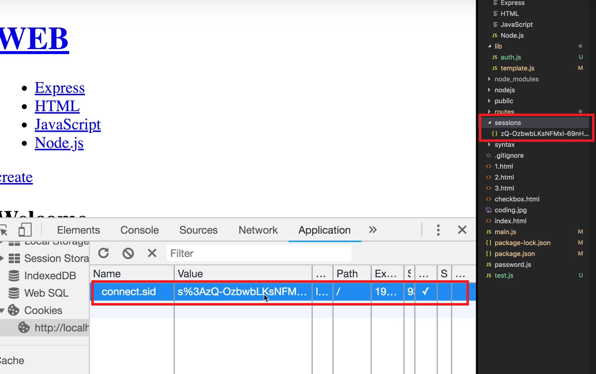

Nodejs_Express_Session
===============================================
Session은 client를 식별하는 값만을 client에게 전송하고 Sever가 로그인에 대한 정보를 Session폴더에 저장합니다.(밑에 이미지에서는 json파일로 저장하고 있다.)


(1) 옵션
```js

var express = require('express')
var session = require('express-session')

var app = express()

/*
secret : Session id cookie에 서명하는 데 사용되는 문자열이다.꼭 필요한 옵션이다. 다른사람에게 노출되어서는 안된다. 별도의 파일로 관리해야한다.

resave : session data값을 매번 저장할 것인가? (ture : 매번 저장, false : 값이 바뀔때만 저장한다.)

saveUninitialized : session을 필요할 때만 구동 할 것인가? (ture : 필요할 때만, false : 언제나)
*/
app.use(session({
  secret: 'keyboard cat',
  resave: false,    
  saveUninitialized: true
}))

app.get('/f', function (req, res, next) {
  res.send('Hello Session');
})

app.listen(3000, function(){
    console.log('3000!');
});

```

(2) session 객체

```js
var express = require('express')
var session = require('express-session')

var app = express()

//session 미들웨어는 request 객체에 session 객체인 propoty를 추가해준다.
app.use(session({
  secret: 'keyboard cat',
  resave: false,
  saveUninitialized: true
}))

app.get('/f', function (req, res, next) {
    console.log(req.session);
    //session객체에는 사용자에 대한 정보가 담겨져서 온다. 이 정보는 휘발성 Memory로 저장된다.
    if(req.session.num === undefined)
    {
        req.session.num = 1;
    }
    else
    {
        res.session.num = req.session.num + 1;
    }
    res.send(`Views : ${req.session.num}`);
})

app.listen(3000, function(){
    console.log('3000!');
});
```

(3) session store
express문서의 session-file-store부분을 찾아본다.

```js
var express = require('express')
var session = require('express-session')
var FileStore = require('session-file-store')(session)

var app = express()

 //1_ client가 접속하면 server는 session id와 이를 이름으로 하는 파일을 생성
 //2_ session미들웨어는 session폴더에 생성된 파일의 내용을 get함수의 req객체에 propoty로 session 객체로 추가합니다. 

app.use(session({
  secret: 'keyboard cat',
  resave: false,
  saveUninitialized: true,
  //store : session 저장에 사용될 것을 지정하는 옵션이다.
  //여기에 MySQL을 추가하여 저장하는 것이 가능하다.
  store:new FileStore() //new FileStore([option]) 이 option에는 저장에 관한 옵션을 줄 수 있다.
}))

app.get('/f', function (req, res, next) {
    console.log(req.session);
//3.1_ 처음에는 num propoty를 생성하고 1로 초기화 한다.
    if(req.session.num === undefined)
    {
        req.session.num = 1;
    }
//3.2_ 그후 접속에는 num propoty가 있는 걸 판단하고 그 값을 1씩 증가한다.(변경된 session의 값들은 설정된 저장소에 업데이트 된다.)
    else
    {
        req.session.num = req.session.num + 1;
    }
  res.send(`Views : ${req.session.num}`);
})

app.listen(3000, function(){
    console.log('3000!');
});

```


(4) 인증 구현
예제 파일 확인

(5) 수업을 마치며

[도전 과제]
```
cookie에서 사용된 보안 옵션

https통신

다중사용자 수용

federation authentication(타사 인증)
oauth
Passport.js
```
