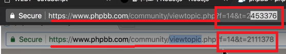

Node.js
======================================================
초기의 JS는 사용자와 상호작용하기 위한 웹브라우저에서 사용되는 언어였다. 2008년 구글이 V6 엔진(성능 향상을 위해)을 계발하였고 Node.js는 V8을 기반으로 컴퓨터 자체를 제어한다. 이걸 이용하여 Web page를 자동으로 생성하는 Web Application을 만들었다.

## 1) nodeJS - 설치
웹브라우저가 html이라는 언어를 통해 웹 어플리케이션이 만든 기능 문서를 해석하여 출력하듯이

(웹 애플리케이션 --HTML--> 웹 페이지 ----> 웹브라우저)

nodeJS Runtime는 JavaScript라는 언어를 통해 NodeJS Application이 만든 기능을 해석하여 출력해준다.

(nodeJS Application --JavaScript--> code가 작성된 문서 ----> NodeJS Runtime)

**`[codeanywhere 사용법]`**
- Codeanywhere에서 내 connections인 NodeJs에서 오른쪽 마우스>info를 누르면 내가 만든 웹서버에 접속할 수 있는 URL등의 정보를 볼 수 있다.
- 내 connections인 NodeJS를 실행하고 싶다면 오른쪽 마우스>turnON, 종료하고 싶다면 오른쪽 마우스>turnOFF을 누른다.
- 원격에 있는 컴퓨터 이므로 오른쪽 마우스>SSH Terminal로 원격 제어한다.

**`[nodeJS 명령어]`**
- node라고 명령을 치면 >가 나오면서 nodeJS에게 명령을 줄 수 있다.
- nodeJS에서 나오고 싶다면 CTRL + C를 두번 누르거나 .exit명령어를 친다.
- SSH에 직접 실행 했으면 하는 code를 치는건 힘드므로 file을 만들어서 실행하고 싶은 code를 작성하고 nodeJS에게 넣어서 실행시키게 한다.
(1) connections의 NodeJs의 오른쪽 마우스>Create File
(2) 파일 이름 작성 후 ok
(3) js로 파일 작성
(4) SSH에서 `node (파일 이름)` 명령어를 실행하면 파일의 code가 실행된다. 

필요한 JS문법 --> 필요한 nodeJS기능 --> 이걸로 만들 수 있는 web application
이 과정을 반복

## 2) nodeJS - URL사용법
(1) URL 이해
php에서 값에 따라 다른 페이지를 생성하여 전송한다.

- protocol : 통신 규칙. 사용자가 server와 어떤 방식으로 통신할 것인가? http는 웹 브라우져와 웹 서버의 통신 규칙이다. 
- host(domain) : 인터넷에 접속된 특정한 컴퓨터를 가리키는 주소.
- port : 한 대의 컴퓨터 안에 여러대의 서버가 작동할 수 있다.(서버도 결국 프로그램이다.) 그중 어떤 것인지 판별하기 위해 필요하다. (tcp에서 사용되는 그 port이다. tcp에서는 프로세스를 구분한다고 설명한다.) http => 80, https => 8080을 사용하는걸 기본으로 한다.
- path : 주소, 그 컴퓨터의 어떤 폴더의 어떤 파일인가를 나타낸다. 
- query string : 웹서버에게 정보를 줄 수 있다. `?` 이후의 부터 query string이다. 

