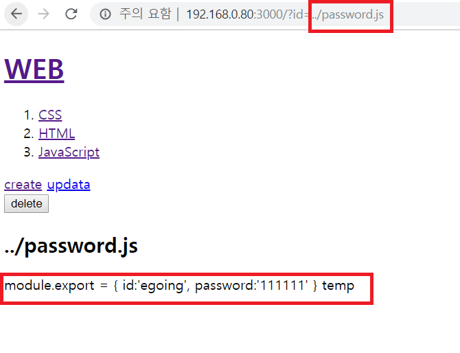
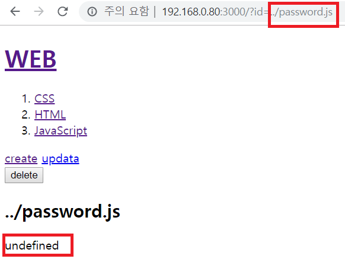
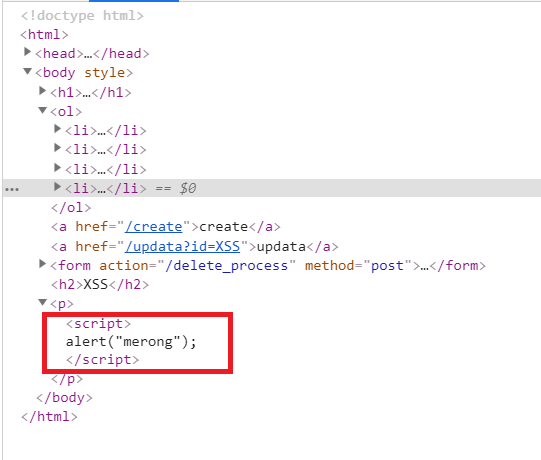
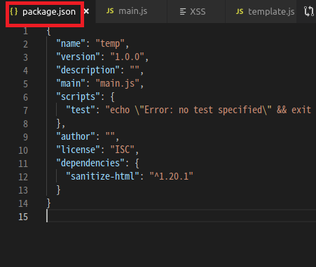
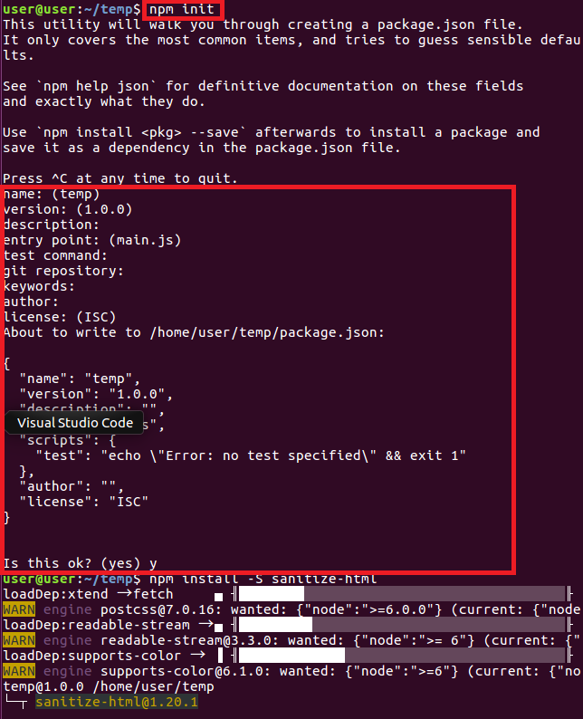

Node.js
======================================================
초기의 JS는 사용자와 상호작용하기 위한 웹브라우저에서 사용되는 언어였다. 2008년 구글이 V6 엔진(성능 향상을 위해)을 계발하였고 Node.js는 V8을 기반으로 컴퓨터 자체를 제어한다. 이걸 이용하여 Web page를 자동으로 생성하는 Web Application을 만들었다.

## 1) nodeJS - 설치
웹브라우저가 html이라는 언어를 통해 웹 어플리케이션이 만든 기능 문서를 해석하여 출력하듯이


(웹 애플리케이션 --HTML--> 웹 페이지 ----> 웹브라우저)

nodeJS Runtime는 JavaScript라는 언어를 통해 NodeJS Application이 만든 기능을 해석하여 출력해준다.


(nodeJS Application --JavaScript--> code가 작성된 문서 ----> NodeJS Runtime)

**`[codeanywhere 사용법]`**
- Codeanywhere에서 내 connections인 NodeJs에서 오른쪽 마우스>info를 누르면 내가 만든 웹서버에 접속할 수 있는 URL등의 정보를 볼 수 있다.
- 내 connections인 NodeJS를 실행하고 싶다면 오른쪽 마우스>turnON, 종료하고 싶다면 오른쪽 마우스>turnOFF을 누른다.
- 원격에 있는 컴퓨터 이므로 오른쪽 마우스>SSH Terminal로 원격 제어한다.

**`[우분투에 nodejs 최신 버전 설치]`**
1. 설치 확인 터미널에 `node` 명령어를 사용했을 때 설치되어 있지 않다면 설치하라는 안내문이 뜬다. 
2. 설치 명령어 `sudo apt install nodejs-legacy`
3. 설치 후 버전 확인한다. `ndoe -v`
4. 최선 버전으로 업데이트 한다. 
    - sudo npm cache clean -f 캐쉬를 삭제한다.
    - sudo npm install -g n n모듈을 설치한다. 
    - sudo n stable 안정화(LTS) 버전을 설치한다.

**`[nodeJS 명령어]`**
- node라고 명령을 치면 >가 나오면서 nodeJS에게 명령을 줄 수 있다.
- nodeJS에서 나오고 싶다면 CTRL + C를 두번 누르거나 .exit명령어를 친다.
- SSH에 직접 실행 했으면 하는 code를 치는건 힘드므로 file을 만들어서 실행하고 싶은 code를 작성하고 nodeJS에게 넣어서 실행시키게 한다.
(1) connections의 NodeJs의 오른쪽 마우스>Create File
(2) 파일 이름 작성 후 ok
(3) js로 파일 작성
(4) SSH에서 `node (파일 이름)` 명령어를 실행하면 파일의 code가 실행된다. 

필요한 JS문법 --> 필요한 nodeJS기능 --> 이걸로 만들 수 있는 web application
이 과정을 반복


## 2) nodeJS - URL사용법
(1) URL 이해
php에서 값에 따라 다른 페이지를 생성하여 전송한다.


- protocol : 통신 규칙. 사용자가 server와 어떤 방식으로 통신할 것인가? http는 웹 브라우져와 웹 서버의 통신 규칙이다. 
- host(domain) : 인터넷에 접속된 특정한 컴퓨터를 가리키는 주소.
- port : 한 대의 컴퓨터 안에 여러대의 서버가 작동할 수 있다.(서버도 결국 프로그램이다.) 그중 어떤 것인지 판별하기 위해 필요하다. (tcp에서 사용되는 그 port이다. tcp에서는 프로세스를 구분한다고 설명한다.) http => 80, https => 8080을 사용하는걸 기본으로 한다.
- path : 주소, 그 컴퓨터의 어떤 폴더의 어떤 파일인가를 나타낸다. 
- query string : 웹서버에게 정보를 줄 수 있다. `?` 이후의 부터 query string이다. 


(2) URL의 query string으로 동적인 웹페이지 만들기
URL에서 query string을 파싱해서 본문의 제목에 적용한다.
**[추천 검색어]**
```
nodejs url parse query string
```

## 3) nodeJS - 파일 제어
CRUD (Create Read Update Delete)정보를 다루는 핵심적인 동작이다. 어디든 정보를 제어하기 위해서는 언제 이걸 먼저 알아본다.
nodejs 공식 홈페이지에는 nodejs의 기능을 모듈별로 정리해둔 문서가 있다. 참고하자.

```js
//filesystem 모듈을 가져온다.
var fs = require('fs');
//읽어들일 파일과 그걸 처리할 함수를 매개변수로 받는다. 'utf8'은 파일을 어떤 형식으로 읽은 것인지 알려주는 것이다.
fs.readFile('sample.txt', 'utf8', function(err,data){
    console.log(data);
});
```

**[추천 검색어]**
```
nodejs file read
```

## 4) nodeJS - 콘솔에서 입력값
nodeJS의 console에서 명령어를 실행 할 때 입력값을 주는 방법.
**[Input]**
Parameter : 입력되는 정보의 형식
Argument : 형식에 맞게 직접 입력되는 값 

C/C++에서 프로그램 실행시에 main함수에 argv매개변수를 줬던 것과 같다.
```js
//code
var args = process.argv;
console.log(args);

//명령어 node (파일) (입력 값)
 node conditional.js egoing

//출력
//process.argv는 입력된 값을 배열로 가지고 있다.
[ '/usr/bin/nodejs',    => nodeJS runtime이 어디 있는가>
  '/home/user/temp/nodejs/conditional.js', => 실행 중 파일의 위치
  'egoing' ]        => 3번째 부터 입력된 값
```

**[추천 검색어]**
```
nodejs console input parameters
```

(2) 홈페이지 구현
```js
var http = require('http');
var fs = require('fs');
var url = require('url');
 
var app = http.createServer(function(request,response){
    var _url = request.url;
    var queryData = url.parse(_url, true).query;
    var pathname = url.parse(_url, true).pathname;
    if(pathname === '/'){

      //(WEB을 눌렀을 때)id가 없다면 그에 따른 본문과 제목 처리 
      if(queryData.id === undefined){
        fs.readFile(`data/${queryData.id}`, 'utf8', function(err, description){
          
          //내용을 id가 아닌 직접 체워 넣는다.
          var title = 'Welcome';
          var description = 'Hello, Node.js';

          var template = `
          <!doctype html>
          <html>
          <head>
            <title>WEB1 - ${title}</title>
            <meta charset="utf-8">
          </head>
          <body>
            <h1><a href="/">WEB</a></h1>
            <ul>
              <li><a href="/?id=HTML">HTML</a></li>
              <li><a href="/?id=CSS">CSS</a></li>
              <li><a href="/?id=JavaScript">JavaScript</a></li>
            </ul>
            <h2>${title}</h2>
            <p>${description}</p>
          </body>
          </html>
          `;
          response.writeHead(200);
          response.end(template);
        });
        
      }
      //WEB 외의 URL을 눌러서 id값을 전송 했을때
      else {
        fs.readFile(`data/${queryData.id}`, 'utf8', function(err, description){
          //전송된 id를 title로 적용
          var title = queryData.id;
          var template = `
          <!doctype html>
          <html>
          <head>
            <title>WEB1 - ${title}</title>
            <meta charset="utf-8">
          </head>
          <body>
            <h1><a href="/">WEB</a></h1>
            <ul>
              <li><a href="/?id=HTML">HTML</a></li>
              <li><a href="/?id=CSS">CSS</a></li>
              <li><a href="/?id=JavaScript">JavaScript</a></li>
            </ul>
            <h2>${title}</h2>
            //본문 내용 description
            <p>${description}</p>
          </body>
          </html>
          `;
          response.writeHead(200);
          response.end(template);
        });
      }
    } else {
      response.writeHead(404);
      response.end('Not found');
    }
});
app.listen(3000);
```

## 5) nodeJS - 파일 목록 알아내기
fs(file system 모듈)로 특정 폴더 안의 파일 목록을 읽어 온다.
```js
//작성 code 
//목록을 가져올 폴더 경로(node 명령어를 실행한 폴더를 기준으로)
var testFolder = './data/';
var fs = require('fs');

//file system 목록을 읽어들 폴더 경로와 파일 리스트를 매개변수로 입력받아 처리하는 함수가 매개변수로 입력된다.
fs.readdir(testFolder, function(error, fileList){
    console.log(fileList);
})

//결과 출력
//배열로 결과 출력
[ 'CSS', 'HTML', 'JavaScript' ]
```

**[추천 검색어]**
```
nodeJS file list in directory
```

(1) 글 목록을 출력하기
위의 방법을 사용하여 client가 요청할 수 있는 글 목록(URL list)을 출력한다.
```js
var http = require('http');
var fs = require('fs'); 
var url = require('url');   

var app = http.createServer(function(request,response){

    var _url = request.url;
    var queryData = url.parse(_url, true).query;
    var pathname = url.parse(_url,true).pathname;

    if(pathname === '/')
    {
      if(queryData.id === undefined)
      {
        //client가 접근 할 수 있는 파일의 목록을 가져와서 파일 목록 URL을 페이지에 작성한다.
        fs.readdir('./data',function(error, fileList){
          var title = 'Welcome';
          var description = 'Hello, Node.js';

          var list = '<ol>';
          var i=0;
          while(i < fileList.length)
          {
            list = list +`<li><a href="/?id=${fileList[i]}">${fileList[i]}</a></li>`;

            i = i + 1;
          }
          list = list+'</ol>';

          var template = `
          <!doctype html>
          <html>
            <head>
              <title>WEB1 - ${title}</title>
              <meta charset="utf-8">
            </head>
            <body>
              <h1><a href="/">WEB</a></h1>
              ${list}
              <h2>${title}</h2>
              <p>${description}</p>
            </body>
          </html>`;

          response.writeHead(200);
          response.end(template);
        });
      }
      else
      {
        fs.readdir('./data',function(error, fileList){
            var title = queryData.id;
            
            var list = '<ol>';
            var i=0;
            while(i < fileList.length)
            {
              list = list +`<li><a href="/?id=${fileList[i]}">${fileList[i]}</a></li>`;

              i = i + 1;
            }
            list = list+'</ol>';

          fs.readFile(`data/${queryData.id}`,'utf8',function(err, description){

            var template = `
              <!doctype html>
                <html>
                  <head>
                    <title>WEB1 - ${title}</title>
                    <meta charset="utf-8">
                  </head>
                  <body>
                    <h1><a href="/">WEB</a></h1>
                    ${list}
                    <h2>${title}</h2>
                    <p>${description}</p>
                  </body>
                </html>`;

              response.writeHead(200);
              response.end(template);
            });
          });
        }
    }
    else
    {
      response.writeHead(404);
      response.end('Not found');
    }
});

app.listen(3000);
```

(2) 함수를 이용해서 정리 정돈
```js
var http = require('http');
var fs = require('fs'); 
var url = require('url');   

function TemplateHTML(title, list, body)
{
  return `
  <!doctype html>
  <html>
    <head>
      <title>WEB1 - ${title}</title>
      <meta charset="utf-8">
    </head>
    <body>
      <h1><a href="/">WEB</a></h1>
      ${list}
      ${body}
    </body>
  </html>`;
}

function TemplateList(fileList)
{
  var list = '<ol>';
  var i=0;
  while(i < fileList.length)
  {
    list = list +`<li><a href="/?id=${fileList[i]}">${fileList[i]}</a></li>`;
    i = i + 1;
  }
  list = list+'</ol>';
  return list;
}

var app = http.createServer(function(request,response){

    var _url = request.url;
    var queryData = url.parse(_url, true).query;
    var pathname = url.parse(_url,true).pathname;
    if(pathname === '/')
    {
      if(queryData.id === undefined)
      {
        fs.readdir('./data',function(error, fileList){
          var title = 'Welcome';
          var description = 'Hello, Node.js';

          var list = TemplateList(fileList);
          var template = TemplateHTML(title, list, `<h2>${title}</h2><p>${description}</p>`);

          response.writeHead(200);
          response.end(template);
        });
      }
      else
      {
        fs.readdir('./data',function(error, fileList){
            fs.readFile(`data/${queryData.id}`,'utf8',function(err, description){

              var title = queryData.id;
              var list = TemplateList(fileList);
              var template = TemplateHTML(title, list, `<h2>${title}</h2><p>${description}</p>`);

              response.writeHead(200);
              response.end(template);
            });
          });
        }
    }
    else
    {
      response.writeHead(404);
      response.end('Not found');
    }

});

app.listen(3000);
```

## 6) nodeJS - 동기와 비동기 그리고 콜백
동기적(synchronous)
다음일이 처리 되길 기다리고 다음 일을 처리하는 것. 또한 서로 다른 컴퓨터의 상태를 같게 맞춰주는 것도 같은 의미로 쓰인다.

비동기적(asynchronous)
병렬적으로 동시에 여러가지 처리하는 것. 효율적이지만 복잡하다.


- fileSystem 모듈에 readFileSync함수와 readFile함수가 있다. 두 함수의 차이는 매개변수에 callback함수가 있는가 이다. 
```js
var fs = require('fs');

//readFileSync
//파일이 다 읽히기를 기다리고 그 값을 매개변수에 대입하여 그 후에 처리한다. 동기적
console.log(A);
var result = fs.readFileSync('nodejs/sample.txt','utf8');
console.log(result);
console.log('C');

//readFile
//파일이 다 읽히면 그 처리를 할 함수를 대입하고 다음으로 넘어간다. 비동기적
console.log('A');
fs.readFile('nodejs/sample.txt','utf8',function(err, result){
    console.log(result);
});

console.log('C');
```
nodejs는 비동기적을 선호한다.

(2) callback
```
//이름이 없는 함수는 객체에 넣어 이름을 부여할 수 있다.
var a = function(){
    console.log('A');
}

function slowfunc(callback)
{
    callback();
}

slowfunc(a);
```

## 7) nodeJS - 패키지 매니저(Package manager)와 PM2
Package : 프로그램을 부르는 여러가지 용어 중 하나.
NPM : nodeJS에서 사용되는 패키지 매니저이다.

(1) PM2
nodeJS의 패키지 중 하나이다. 실행 중인 nodeJS 프로그램을 감시하다가 원치않은 상황에서 종료되었다면 다시 실행해주거나 nodeJS가 실행한 파일의 code가 수정되었다면 자동으로 프로그램을 끄고 다시 시작해준다.

Advanced, production process manager for Node.js
Node.js의 고급 프로덕션 프로세스 관리자

## 8) HTML - Form
웹브라우저(client)에서 서버로 데이터를 전송할 때 사용한다. 

```js
//client에게 전송하기 위해 입력 받는 부분을 form으로 감싼다.
//action : 입력받은 것을 저 주소의 서버에게 전송한다는 뜻이다.
//이때 입력받는 tag에는 name이 있어야 한다.
//데이터를 전송할 때 URL에 노출하기 않기 위해 post로 전송한다.
<form action="192.168.0.80:3000/process_create" method="post">
    //text 글자를 입력받는 input tag의 type이다.이다.
    <p><input type="text" name="title"></p>
    <p>
        //위에서 더 나아가 여러줄을 입력 받을 수 있는 tag이다.
        <textarea name="description"></textarea>
    </p>
    <p>
        //전송 버튼
        <input type="submit">
    </p>
</form>
```
submit버튼을 누르면 입력 내용이 전송된다.

그리고 URL에 qeury string으로 내용이 전송된다.

하지만 이렇게 URL에 data가 노출되는 것은 좋은 방법은 아니다. 저런 URL이 다른 사람에게 그대로 노출된다면 내가 작성하여 서버에 저장한 내용이 삭제, 수정 될 우려가 있다. (이것은 server에서 client로 전송 할때도 만찬가지 인데 만약 id가 아닌 폴더의 경로를 그대로 전송한다면 server의 내부구조를 알아내 악용할 수 있다.)
그러므로 서버에서 data를 가져올 때는 qeury string으로 내부를 가리고 웹브라우저에서 서버로 data를 전송할 때는 POST로 전송한다.
Request Headers와 함께 Form Data로 전송된다. 


## 9) 글생성 UI만들기
```js
var http = require('http');
var fs = require('fs'); 
var url = require('url');   

function TemplateHTML(title, list, body)
{
  return `
  <!doctype html>
  <html>
    <head>
      <title>WEB1 - ${title}</title>
      <meta charset="utf-8">
    </head>
    <body>
      <h1><a href="/">WEB</a></h1>
      ${list}

      //글 작성 page를 띄우기 위한 URL
      <a href="/create">create</a>

      ${body}
    </body>
  </html>`;
}

function TemplateList(fileList)
{
  var list = '<ol>';
  var i=0;
  while(i < fileList.length)
  {
    list = list +`<li><a href="/?id=${fileList[i]}">${fileList[i]}</a></li>`;
    i = i + 1;
  }
  list = list+'</ol>';

  return list;
}

var app = http.createServer(function(request,response){
    var _url = request.url;
    var queryData = url.parse(_url, true).query;
    var pathname = url.parse(_url,true).pathname;

    if(pathname === '/')
    {
      if(queryData.id === undefined)
      {
        fs.readdir('./data',function(error, fileList){
          var title = 'Welcome';
          var description = 'Hello, Node.js';
          var list = TemplateList(fileList);

          var template = TemplateHTML(title, list, `<h2>${title}</h2><p>${description}</p>`);

          response.writeHead(200);
          response.end(template);
        });
      }
      else
      {
        fs.readdir('./data',function(error, fileList){
            fs.readFile(`data/${queryData.id}`,'utf8',function(err, description){

              var title = queryData.id;
              var list = TemplateList(fileList);
              var template = TemplateHTML(title, list, `<h2>${title}</h2><p>${description}</p>`);

              response.writeHead(200);
              response.end(template);
            });
          });
        }
    }

    //192.168.0.80:3000/create을 처리하는 부분이다.
    else if(pathname === '/create')
    {
      fs.readdir('./data',function(error, fileList){
        var title = 'WEB - create';
        
        //글 목록 작성 
        var list = TemplateList(fileList);
        //본문
        var template = TemplateHTML(title, list,`
          
          //작성하여 전송하는 부분(웹브라우저는 자동으로 http를 붙여 주지만 여기서는 http 프로토콜을 사용한다고 명시해야 한다.)
          <form action="http://192.168.0.80:3000/create_process" method="POST">
          <p><input type="text" name="title"></p>
          <p>
            <textarea name="description"></textarea>
          </p>
          <p>
            <input type="submit">
          </p>
          </form>

          `);

          response.writeHead(200);
          response.end(template);
      });
    }
    else
    {
      response.writeHead(404);
      response.end('Not found');
    }
});

app.listen(3000);
```

## 10) POST방식으로  전송된 데이터 받기
```js
var http = require('http');
var fs = require('fs'); 
var url = require('url');   
var qs = require('querystring');

function TemplateHTML(title, list, body)
{
  return `
  <!doctype html>
  <html>
    <head>
      <title>WEB1 - ${title}</title>
      <meta charset="utf-8">
    </head>
    <body>
      <h1><a href="/">WEB</a></h1>
      ${list}
      <a href="/create">create</a>
      ${body}
    </body>
  </html>`;
}

function TemplateList(fileList)
{
  var list = '<ol>';
  var i=0;

  while(i < fileList.length)
  {
    list = list +`<li><a href="/?id=${fileList[i]}">${fileList[i]}</a></li>`;

    i = i + 1;
  }

  list = list+'</ol>';

  return list;
}

var app = http.createServer(function(request,response){

    var _url = request.url;
    var queryData = url.parse(_url, true).query;
    var pathname = url.parse(_url,true).pathname;

    if(pathname === '/')
    {
      if(queryData.id === undefined)
      {
        fs.readdir('./data',function(error, fileList){
          var title = 'Welcome';
          var description = 'Hello, Node.js';
          var list = TemplateList(fileList);
          var template = TemplateHTML(title, list, `<h2>${title}</h2><p>${description}</p>`);

          response.writeHead(200);
          response.end(template);

        });
      }
      else
      {
        fs.readdir('./data',function(error, fileList){

            fs.readFile(`data/${queryData.id}`,'utf8',function(err, description){

              var title = queryData.id;
              var list = TemplateList(fileList);
              var template = TemplateHTML(title, list, `<h2>${title}</h2><p>${description}</p>`);

              response.writeHead(200);
              response.end(template);
            });
          });
        }
    }
    else if(pathname === '/create')
    {
      fs.readdir('./data',function(error, fileList){

        var title = 'WEB - create';
        var list = TemplateList(fileList);
        var template = TemplateHTML(title, list,`

          <form action="http://192.168.0.80:3000/create_process" method="post">
          <p><input type="text" name="title" placeholder="title"></p>
          <p>
            <textarea name="description" placeholder="description"></textarea>
          </p>
          <p>
            <input type="submit" >
          </p>
          </form>
          `);

          response.writeHead(200);
          response.end(template);
      });
    }
    //form으로 입력 받았을 때
    else if(pathname === '/create_process')
    {
      var body = '';

      //'data' : 조각조각의 data를 수신할 때 마다 callback함수 호출. data라는 인자로 수신할 정보를 callback에 입력.
      //이런 방식을 사용하는 이유는 너무 큰 데이터를 한번에 받으면 서버에 무리가 갈 수 있기 때문이다.
      request.on('data', function(data){
          //조각조각으로 전송된 데이터가 수신될 때 마다 body에 추가
          body = body + data;
      });

      //'end' : 그렇게 데이터를 수신하다가 더이상 들어오는 데이터가 없다면 callback함수 호출. (정보 수신 끝)
      request.on('end', function(){
          //qs => qerystring모듈
          //title=temp&description=nodejs+is.... 이렇게 받은 데이터를 parse함수가 객체화 하여 반환해 준다.
          var post = qs.parse(body);

          //post의 form data에 title과 description에 대한 데이터가 들어 있다.
          var title = post.title;
          var description = post.description;
      });

      response.writeHead(200);
      response.end('success');
    }
    else
    {
      response.writeHead(404);
      response.end('Not found');
    }
});

app.listen(3000);
```
**[추천 검색어]**
```
//post방식으로 받은 정보를 가져오는 방법
nodejs get post data
```

## 11) 파일생성과 리다이렉션
```js
var http = require('http');
var fs = require('fs'); 
var url = require('url');   
var qs = require('querystring');

function TemplateHTML(title, list, body)
{
  return `
  <!doctype html>
  <html>
    <head>
      <title>WEB1 - ${title}</title>
      <meta charset="utf-8">
    </head>
    <body>
      <h1><a href="/">WEB</a></h1>
      ${list}
      <a href="/create">create</a>
      ${body}
    </body>
  </html>`;
}

function TemplateList(fileList)
{
  var list = '<ol>';
  var i=0;

  while(i < fileList.length)
  {
    list = list +`<li><a href="/?id=${fileList[i]}">${fileList[i]}</a></li>`;
    i = i + 1;
  }
  list = list+'</ol>';

  return list;
}

var app = http.createServer(function(request,response){

    var _url = request.url;
    var queryData = url.parse(_url, true).query;
    var pathname = url.parse(_url,true).pathname;

    if(pathname === '/')
    {
      if(queryData.id === undefined)
      {
        fs.readdir('./data',function(error, fileList){
          var title = 'Welcome';
          var description = 'Hello, Node.js';

          var list = TemplateList(fileList);
          var template = TemplateHTML(title, list, `<h2>${title}</h2><p>${description}</p>`);

          response.writeHead(200);
          response.end(template);
        });
      }
      else
      {
        fs.readdir('./data',function(error, fileList){
            fs.readFile(`data/${queryData.id}`,'utf8',function(err, description){
              var title = queryData.id;
              var list = TemplateList(fileList);

              var template = TemplateHTML(title, list, `<h2>${title}</h2><p>${description}</p>`);

              response.writeHead(200);
              response.end(template);
            });
          });
        }
    }
    else if(pathname === '/create')
    {
      fs.readdir('./data',function(error, fileList){
        var title = 'WEB - create';
        var list = TemplateList(fileList);
        var template = TemplateHTML(title, list,`

          <form action="http://192.168.0.80:3000/create_process" method="post">
          <p><input type="text" name="title" placeholder="title"></p>
          <p>
            <textarea name="description" placeholder="description"></textarea>
          </p>
          <p>
            <input type="submit" >
          </p>
          </form>
          `);

          response.writeHead(200);
          response.end(template);
      });
    }
    else if(pathname === '/create_process')
    {
      var body = '';

      request.on('data', function(data){
          body = body + data;
      });

      request.on('end', function(){
          var post = qs.parse(body);
          var title = post.title;
          var description = post.description;

          //파일 생성하고 안에 내용 추가. write할때 파일이 없다면 자동으로 생성한다.
          fs.writeFile(`./data/${post.title}`,`${post.description}`,'utf8',function(err){
              //301 : 앞으로 새 URL로 영원히 접근해야한다.
              //302 : 지금만 이 URL로 이동한다.
              response.writeHead(302,{Location: `/?id=${title}`});
              response.end();

          }); 

      });
    }
    else
    {
      response.writeHead(404);
      response.end('Not found');
    }
});

app.listen(3000);
```

**[추천 검색어]**
```
//파일 생성 방법
nodejs create file
nodejs write file
//리다이렉션
nodejs redirection
```

## 12) 글 수정
```js
var http = require('http');
//filesystem 모듈 : 파일을 제어하는 모듈
var fs = require('fs'); 
var url = require('url');   
var qs = require('querystring');

//매개변수에 control을 추가 하였다.
//control은 페이지를 생성, 수정에 대한 html code를 입력받는 매개변수이다.
function TemplateHTML(title, list, body, control)
{
  return `
  <!doctype html>
  <html>
    <head>
      <title>WEB1 - ${title}</title>
      <meta charset="utf-8">
    </head>
    <body>
      <h1><a href="/">WEB</a></h1>
      ${list}
      ${control}
      ${body}
    </body>
  </html>`;
}

function TemplateList(fileList)
{
  var list = '<ol>';
  var i=0;
  while(i < fileList.length)
  {
    list = list +`<li><a href="/?id=${fileList[i]}">${fileList[i]}</a></li>`;
    i = i + 1;
  }
  list = list+'</ol>';

  return list;
}

var app = http.createServer(function(request,response){
    var _url = request.url;
    var queryData = url.parse(_url, true).query;
    var pathname = url.parse(_url,true).pathname;

    if(pathname === '/')
    {
      if(queryData.id === undefined)
      {
        fs.readdir('./data',function(error, fileList){
          var title = 'Welcome';
          var description = 'Hello, Node.js';

          var list = TemplateList(fileList);
          var template = TemplateHTML(title, list,
             `<h2>${title}</h2><p>${description}</p>`,
             //WEB페이지에서는 페이지 생성만 가능하다.
              '<a href="/create">create</a>');

          response.writeHead(200);
          response.end(template);
        });
      }
      else
      {
        fs.readdir('./data',function(error, fileList){
            fs.readFile(`data/${queryData.id}`,'utf8',function(err, description){
              var title = queryData.id;
              var list = TemplateList(fileList);
              var template = TemplateHTML(title, list,
                 `<h2>${title}</h2><p>${description}</p>`,
                  //WEB페이지 외에서는 페이지 생성과 수정 모두 가능하다.
                  `<a href="/create">create</a> <a href="/updata?id=${title}">updata</a>`);

              response.writeHead(200);
              response.end(template);
            });
          });
        }
    }
    else if(pathname === '/create')
    {
      fs.readdir('./data',function(error, fileList){
        var title = 'WEB - create';
        var list = TemplateList(fileList);
        var template = TemplateHTML(title, list,`
          <form action="http://192.168.0.80:3000/create_process" method="post">
          <p><input type="text" name="title" placeholder="title"></p>
          <p>
            <textarea name="description" placeholder="description"></textarea>
          </p>
          <p>
            <input type="submit" >
          </p>
          </form>
          `, '');
          response.writeHead(200);
          response.end(template);
      });
    }
    else if(pathname === '/create_process')
    {
      var body = '';
      request.on('data', function(data){
          body = body + data;
      });

      request.on('end', function(){
          var post = qs.parse(body);
          var title = post.title;
          var description = post.description;

          fs.writeFile(`./data/${post.title}`,`${post.description}`,'utf8',function(err){
              response.writeHead(302,{Location: `/?id=${title}`});
              response.end();
          }); 
      });
    }
    //선택한 페이지를 수정할 때 오는 pathname이다.
    else if(pathname === '/updata')
    {
        fs.readdir('./data',function(error, fileList){
          fs.readFile(`data/${queryData.id}`,'utf8',function(err, description){
            var title = 'WEB - update';
            var list = TemplateList(fileList);
            //파일 수정 UI로 파일의 내용을 편집 UI에 넣어주어야한다.
            //input의 hidden는 수정 필요없이 form data로 전송하고 싶은 데이터를 넣어둔다.
            //input은 value로 textarea은 <textarea>내용</textarea> 이렇게 넣어준다.
            var template = TemplateHTML(title, list,`
            
            <form action="http://192.168.0.80:3000/update_process" method="post">
            <p><input type="hidden" name="id" value="${queryData.id}"></p>            
            <p><input type="text" name="title" placeholder="title" value="${queryData.id}"></p>
            <p>
              <textarea name="description" placeholder="description">${description}</textarea>
            </p>
            <p>
              <input type="submit" >
            </p>
            </form>
            `, '');

            response.writeHead(200);
            response.end(template);
          });
        });
    }
    //수정 내용을 받아서 파일을 수정한다.
    else if(pathname === '/update_process')
    {
      var body = '';

      request.on('data', function(data){
          body = body + data;
      });
      request.on('end', function(){
          var post = qs.parse(body);
          var title = post.title;
          var description = post.description;
          //id와 title이 다르면 파일 이름이 변경된다.
          fs.rename(`./data/${post.id}`, `./data/${post.title}`, function(err){
            //파일 내용 수정
            fs.writeFile(`./data/${post.title}`,`${post.description}`,'utf8',function(err){
              response.writeHead(302,{Location: `/?id=${title}`});
              response.end();
            }); 
          });
      });
    }
    else
    {
      response.writeHead(404);
      response.end('Not found');
    }
});

app.listen(3000);
```

## 13) 글 삭제
```js
var http = require('http');
var fs = require('fs'); 
var url = require('url');   
var qs = require('querystring');

function TemplateHTML(title, list, body, control)
{
  return `
  <!doctype html>
  <html>
    <head>
      <title>WEB1 - ${title}</title>
      <meta charset="utf-8">
    </head>
    <body>
      <h1><a href="/">WEB</a></h1>
      ${list}
      ${control}
      ${body}
    </body>
  </html>`;
}


function TemplateList(fileList)
{
  var list = '<ol>';
  var i=0;
  while(i < fileList.length)
  {
    list = list +`<li><a href="/?id=${fileList[i]}">${fileList[i]}</a></li>`;
    i = i + 1;
  }
  list = list+'</ol>';

  return list;
}

var app = http.createServer(function(request,response){
    var _url = request.url;
    var queryData = url.parse(_url, true).query;
    var pathname = url.parse(_url,true).pathname;

    if(pathname === '/')
    {
      if(queryData.id === undefined)
      {
        fs.readdir('./data',function(error, fileList){
          var title = 'Welcome';
          var description = 'Hello, Node.js';

          var list = TemplateList(fileList);
          var template = TemplateHTML(title, list,
             `<h2>${title}</h2><p>${description}</p>`,
              '<a href="/create">create</a>');

          response.writeHead(200);
          response.end(template);
        });
      }
      else
      {
        fs.readdir('./data',function(error, fileList){
            fs.readFile(`data/${queryData.id}`,'utf8',function(err, description){
              var title = queryData.id;
              var list = TemplateList(fileList);
              //<a> 는 get방식 전송을 한다.
              //삭제를 get방식한다면 URL을 복사하는 것으로 다른 사용자가 삭제를 하면 안되는 파일을 삭제할 수 있다.
              //그러므로 <form>를 사용하여 post방식으로 데이터를 전송해야한다.
              var template = TemplateHTML(title, list,
                 `<h2>${title}</h2><p>${description}</p>`,
                  `<a href="/create">create</a> 
                  <a href="/updata?id=${title}">updata</a>

                  <form action="/delete_process" method="post">
                  <input type="hidden" name="id" value="${title}">
                  <input type="submit" value="delete">
                  </form>`);
              response.writeHead(200);
              response.end(template);
            });
          });
        }
    }
    else if(pathname === '/create')
    {
      fs.readdir('./data',function(error, fileList){
        var title = 'WEB - create';
        var list = TemplateList(fileList);
        var template = TemplateHTML(title, list,`
          <form action="http://192.168.0.80:3000/create_process" method="post">
          <p><input type="text" name="title" placeholder="title"></p>
          <p>
            <textarea name="description" placeholder="description"></textarea>
          </p>
          <p>
            <input type="submit" >
          </p>
          </form>
          `, '');
          response.writeHead(200);
          response.end(template);
      });
    }
    else if(pathname === '/create_process')
    {
      var body = '';
      request.on('data', function(data){
          body = body + data;
      });

      request.on('end', function(){
          var post = qs.parse(body);
          var title = post.title;
          var description = post.description;

          fs.writeFile(`./data/${post.title}`,`${post.description}`,'utf8',function(err){
              response.writeHead(302,{Location: `/?id=${title}`});
              response.end();
          }); 
      });
    }
    //선택한 페이지를 수정할 때 오는 pathname이다.
    else if(pathname === '/updata')
    {
        fs.readdir('./data',function(error, fileList){
          fs.readFile(`data/${queryData.id}`,'utf8',function(err, description){
            var title = 'WEB - update';
            var list = TemplateList(fileList);
            //파일 수정 UI로 파일의 내용을 편집 UI에 넣어주어야한다.
            //input의 hidden는 수정 필요없이 form data로 전송하고 싶은 데이터를 넣어둔다.
            //input은 value로 textarea은 <textarea>내용</textarea> 이렇게 넣어준다.
            var template = TemplateHTML(title, list,`
            
            <form action="http://192.168.0.80:3000/update_process" method="post">
            <p><input type="hidden" name="id" value="${queryData.id}"></p>            
            <p><input type="text" name="title" placeholder="title" value="${queryData.id}"></p>
            <p>
              <textarea name="description" placeholder="description">${description}</textarea>
            </p>
            <p>
              <input type="submit" >
            </p>
            </form>
            `, '');

            response.writeHead(200);
            response.end(template);
          });
        });
    }
    //수정 내용을 받아서 파일을 수정한다.
    else if(pathname === '/update_process')
    {
      var body = '';

      request.on('data', function(data){
          body = body + data;
      });
      request.on('end', function(){
          var post = qs.parse(body);
          var title = post.title;
          var description = post.description;
          //id와 title이 다르면 파일 이름이 변경된다.
          fs.rename(`./data/${post.id}`, `./data/${post.title}`, function(err){
            //파일 내용 수정
            fs.writeFile(`./data/${post.title}`,`${post.description}`,'utf8',function(err){
              response.writeHead(302,{Location: `/?id=${title}`});
              response.end();
            }); 
          });
      });
    }
    //삭제 요청이 왔을 때의 URL이다.
    else if(pathname === '/delete_process')
    {

      var body = '';
      request.on('data', function(data){
          body = body + data;
      });
      
      request.on('end', function(){
          var post = qs.parse(body);

          //파일 삭제
          fs.unlink(`./data/${post.id}`, function(err){
            //파일 삭제 후 WEB페이지로 리다이렉트 한다.
            response.writeHead(302, {Location: `/`});
            response.end();
          });
      });
    }
    else
    {
      response.writeHead(404);
      response.end('Not found');
    }
});

app.listen(3000);
```


## 15) 모듈의 형식
code의 복잡함을 막기위해 객체, 함수와 같은 여러 문법을 사용하는 그 중 가장 큰 틀은 모듈이다. 모듈은 파일 단위로 code를 쪼개준다.

```js
//mpart.js
var M = {
    v:'temp',
    f:function(){
        console.log(this.v);
    }
}

//객체를 외부에서 사용할 수 있게 등록
module.exports = M;

//muse.js
//사용할 모듈을 요청
//muse.js와 같은 폴더에 있는 mpart.js를 함수의 매개변수에 입력한다.
var part = require('./mpart.js');

part.f();

```

## 16) 보안
(1) 입력 정보에 대한 보안
외부에서 정보를 입력 받을 때 입력 받은 data가 알맞는지 확인해야 한다. 특히 URL로 서버의 내부 폴더 구조나 파일의 내용을 읽어오는 것도 가능하므로 입력된 값은 주의해야한다.


```js
//queryString의 입력에 대해서 맞는 값이 들어왔는지 확인
var filteredID = path.parse(queryData.id).base;
```
입력에 대한 처리를 해준다면 아무 파일이나 내용을 읽어는 상황을 막을 수 있다.


(2) 출력정보에 대한 보안
사용자에게 요청이 있어 정보를 출력 할 때는 문제가 있을 만한 것들을 필터링한다.

글 작성에서 본문에 `<script>`tag를 사용하여 JS code를 본문에 입력받을 수 있다.


작성한 페이지로 이동하면 JS code가 실행된다. 웹브라우저에 전송된 html을 보면 본문에 JS code가 있는 것을 확인 할 수 있다.



**`[해결 방법]`**
첫번째 script tag로 된 본문을 아예 지우는 방법.
두번째 script tag의 <>를 브라우저에 그대로 출력하게 하여 tag로써 인식하는 것이 아닌 text로 인식하게 하는 방법.
본문 내용을 이렇게 바꾸면

이렇게 출력할 수 있다.


자동으로 이러한 작업을 하기위해 `sanitize`모듈을 사용할 것이다. 이러한 모듈을 다운 받을 때는 평판을 확인하여야 안전하다.
npm은 모듈의 종속성으로 인한 문제를 해결해준다. package.json 프로그램이 어떤 모듈을 사용하기 때문에 필요한지 알려주는 파일이다.


이 프로젝트에서의 모듈 추가를 하기 위해서는 **`npm init`** 명령어를 실행한다. 필요한 정보를 초기화하면 `package.json`을 생성한다.


sanitize-html은 script tag와 같은 위험한 tag는 삭제하고 h1과 같은 tag들은 내용은 두고 tag만 삭제한다.

**[추천 검색어]**
```
html entities
npm sanitize html
```
## 17) 강의 끝

**`AWESOME (경탄할만한, 어마어마한)`** : 여러 라이브러리를 모아둔 북마 코드를 찾을 때
이걸 이용하여 주목받는 모듈을 종종 살펴보자.
```
Node.js AWESOME
```